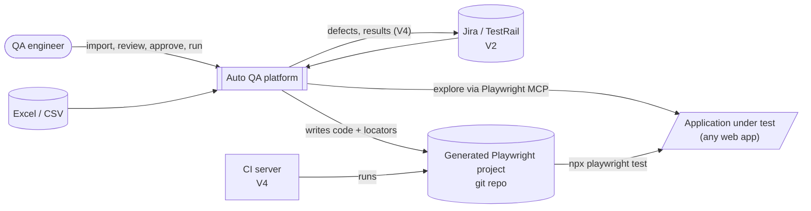
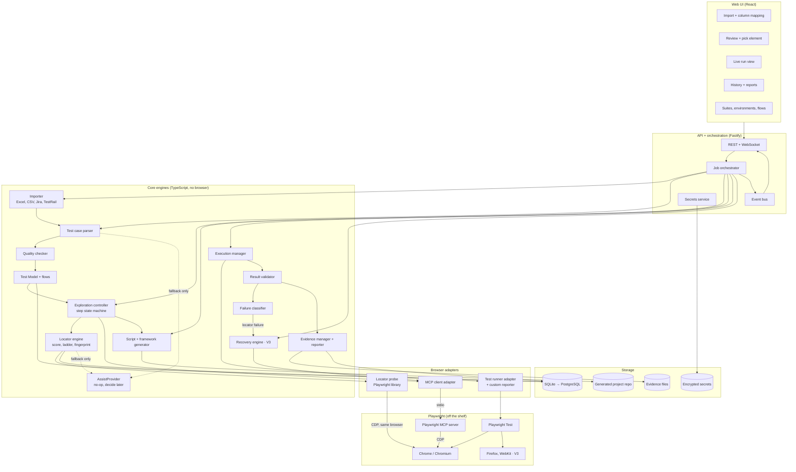
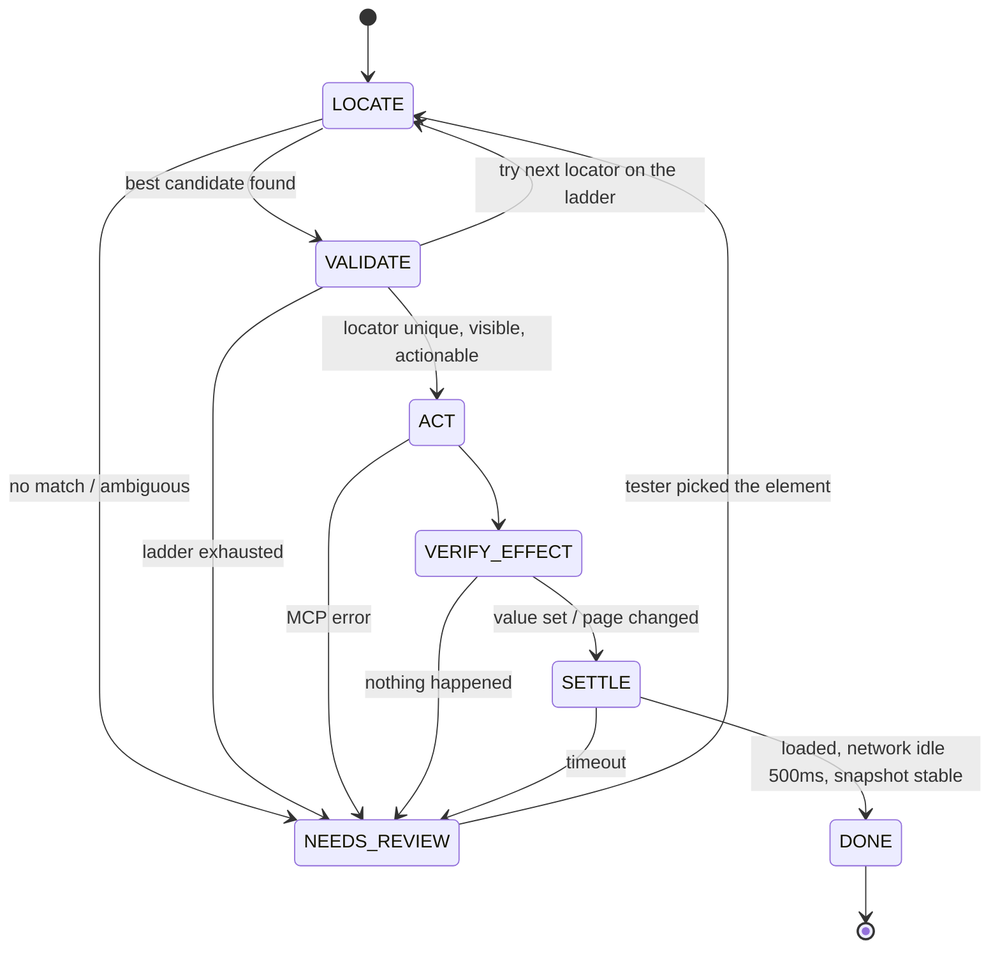
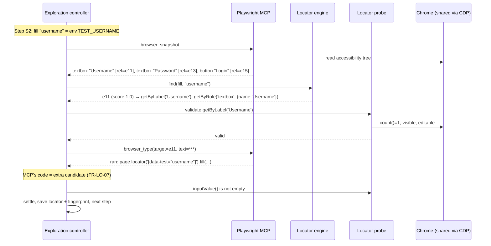
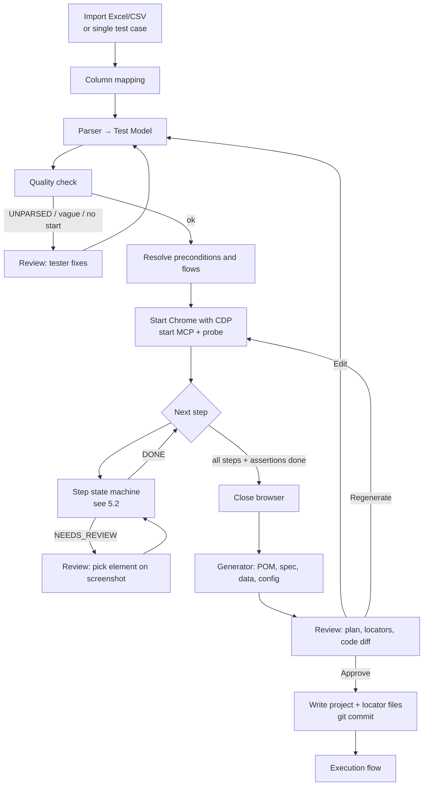
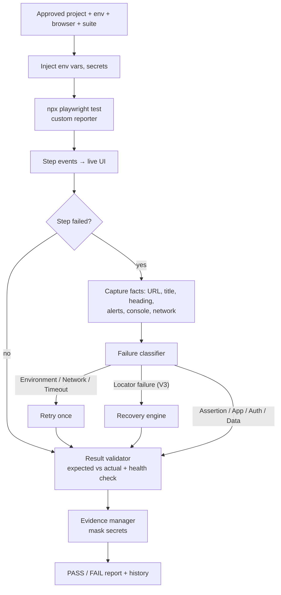
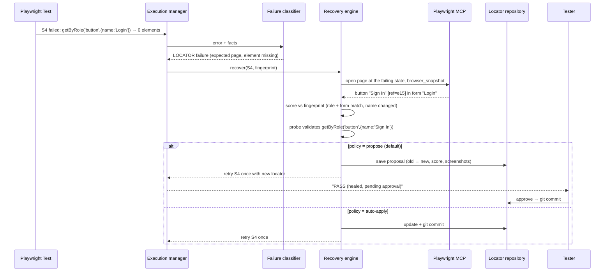
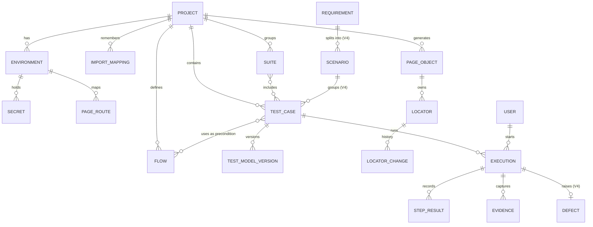
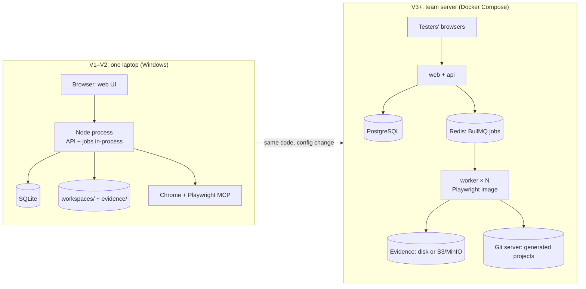

# Auto QA: Architecture

Diagrams are written in Mermaid. They render on GitHub and in VS Code (with a Mermaid extension). To view them in any browser, open [architecture.html](architecture.html).
Requirement IDs (FR-…, D…) refer to [SPEC.md](SPEC.md).

**Contents**
1. [Principles](#1-principles)
2. [System context](#2-system-context)
3. [Components](#3-components)
4. [What we build vs what Playwright provides](#4-what-we-build-vs-what-playwright-provides)
5. [MCP orchestration (no AI agent)](#5-mcp-orchestration-no-ai-agent)
6. [Generation flow](#6-generation-flow)
7. [Execution flow and failure rules](#7-execution-flow-and-failure-rules)
8. [Locator recovery](#8-locator-recovery)
9. [Data model](#9-data-model)
10. [Structured Test Model](#10-structured-test-model)
11. [Code layout](#11-code-layout)
12. [Deployment](#12-deployment)
13. [Architecture by version](#13-architecture-by-version)
14. [Extension points](#14-extension-points)

---

## 1. Principles

- **The platform owns the lifecycle.** Playwright MCP only looks at the page and performs actions (D1).
- **No AI agent.** The test case is the plan. Rule-based code follows it step by step (D1, NFR-01).
- **Generate once, run many.** MCP is used for generation and recovery. Normal runs use Playwright Test only (D2, D3).
- **Validated before stored, and ask instead of guessing** (D6, FR-LO-08).
- **The generated project is standalone** (D5).

## 2. System context



## 3. Components



| Component | Responsibility | Spec |
|---|---|---|
| Importer | Read Excel/CSV, map columns, split steps; Jira/TestRail in V2 | FR-IN |
| Test case parser | Text → Test Model with fixed rules; mark UNPARSED | FR-PA |
| Quality checker | Vague steps, missing start, duplicates | FR-QC |
| Test Model + flows | Versioned JSON model; reusable named flows | FR-PF |
| Exploration controller | MCP client; step state machine; settle and verify | FR-EX |
| Locator engine | Candidate filter, scoring, synonyms, nearby text, ladder, fingerprint, page grouping | FR-LO |
| Locator probe | `count/isVisible/isEnabled/isEditable` with the Playwright library on the shared browser | FR-LO-08 |
| Generator | Handlebars templates → POM, specs, data, config; deterministic | FR-GE |
| Execution manager | Spawns Playwright Test, streams step events | FR-RUN |
| Result validator | Expected vs actual from captured facts; health check | FR-VAL |
| Failure classifier | Ordered rules + retry policy | FR-FC |
| Recovery engine | Fingerprint-based locator healing | FR-REC |
| Evidence manager | Screenshots, traces, logs, masking, reports | FR-EV |
| AssistProvider | Extension point for an optional local AI; no-op by default | FR-AI |

## 4. What we build vs what Playwright provides

| Provided by Playwright MCP / Playwright | Built by us |
|---|---|
| Browser launch, navigation, click, type, select, upload, back | MCP client + tool mapping + version check |
| Accessibility snapshot with temporary refs | Snapshot parser, nearby text, element kinds |
| Playwright code for each action it runs | Candidate scoring, synonyms, ambiguity rule, locator ladder |
| Locator engine (`count`, `isVisible`, …) | Locator probe on the shared browser (CDP) |
| Screenshots, console, network capture | Step state machine, settle and verify rules |
| Playwright Test: runner, projects, workers, trace, video | Parser, Test Model, flows, quality check |
| | Generator, locator repository, execution manager, custom reporter |
| | Validator, classifier, recovery, evidence masking, history, UI, import |

## 5. MCP orchestration (no AI agent)

In Cursor, an AI agent decides which MCP tool to call. In Auto QA, the **platform** decides with fixed rules:

| Job | Cursor | Auto QA |
|---|---|---|
| Understand the test | AI agent | **Parser** → Test Model (before the browser opens) |
| Find the element | AI agent reads the snapshot | **Locator engine** scores snapshot elements |
| Decide the next tool / check the result | AI agent | **Step state machine** |

### 5.1 Action → MCP tool (Playwright MCP 0.0.83)

| Model action | MCP tool | Main input |
|---|---|---|
| navigate / open URL | `browser_navigate` | `url` |
| back | `browser_navigate_back` | |
| fill | `browser_type` (several fields: `browser_fill_form`) | `target`, `text` |
| click, check, radio | `browser_click` | `target` |
| select | `browser_select_option` | `target`, `values` |
| hover | `browser_hover` | `target` |
| press key | `browser_press_key` | `key` |
| upload | `browser_file_upload` | `paths` |
| dialog | `browser_handle_dialog` | `accept` |
| tabs | `browser_tabs` | `action` |
| look at the page | `browser_snapshot` | |
| wait | `browser_wait_for` | `text` / `time` |
| evidence | `browser_take_screenshot`, `browser_console_messages`, `browser_network_requests` | |

`target` is the snapshot ref (e.g. `e15`). The names are checked at startup (D12).

### 5.2 Step state machine



Navigate steps skip LOCATE and VALIDATE. Assertions use LOCATE → VALIDATE only, and their locator becomes the `expect(...)` target.

### 5.3 One step, end to end



## 6. Generation flow



## 7. Execution flow and failure rules



Classification rules, checked in this order (FR-FC-02):

| # | Category | Rule | Retry |
|---|---|---|---|
| 1 | Environment | DNS / connection refused on first navigation; browser launch failure | Once |
| 2 | Network | Failed request or 5xx tied to the failing step | Once |
| 3 | Application | Uncaught page exception, error page, 500 banner | Never |
| 4 | Authentication | Still on the login URL after submit, or an auth error is visible | Never |
| 5 | Test data | Missing env var/data key; validation message on an input | Never |
| 6 | Locator | 0 or >1 matches **and** the page is the expected page | Recovery |
| 7 | Timeout | Timeout not matched above | Once |
| 8 | Assertion | `expect` failed and locators resolved (possible real defect) | Never |

## 8. Locator recovery



## 9. Data model



`USER` exists from V1 with a single default user, so team mode (V3) needs no data migration.

## 10. Structured Test Model

Schema: `src/model/test-model.ts` (zod). This is real parser output (`npm run parse`), shortened:

```json
{
  "id": "TC-REG-014",
  "version": 1,
  "title": "Verify email rejects an already registered address",
  "type": "negative",
  "preconditions": [{ "kind": "flow", "name": "On Registration page", "raw": "On Registration page" }],
  "data": { "Email": "existing.registered@example.com" },
  "steps": [
    { "id": "S1", "action": "fill", "target": "Email", "alternatives": ["Email Address"],
      "value": { "kind": "data", "key": "Email" }, "raw": "Enter Email (Email Address)", "status": "parsed" },
    { "id": "S2", "action": "click", "target": "Continue", "alternatives": [],
      "raw": "Click Continue as applicable", "status": "parsed" }
  ],
  "assertions": [
    { "id": "A1", "type": "text", "expected": "This email is already registered", "negated": false,
      "source": "expected", "raw": "Error \"This email is already registered\" is shown", "status": "parsed" },
    { "id": "A2", "type": "health", "expected": "no crash", "negated": false, "source": "builtin", "status": "parsed" }
  ],
  "source": { "row": 5, "rawSteps": "1. Enter Email (Email Address)\n2. Click Continue as applicable", "rawExpected": "…" },
  "warnings": [{ "at": "S2", "code": "FILLER_REMOVED", "text": "\"as applicable\" ignored" }]
}
```

| Field | Rule |
|---|---|
| Step `id` | `S<n>` with the **tester's own number**. A check written as a step ("3. Observe X") becomes an assertion with `step: "S3"`, so step ids can have gaps. |
| Execution order | Each step-assertion runs after the action steps numbered before it. Expected Result checks and the health check run last (`executionOrder()`). |
| `value` | `{kind: literal \| env \| data \| generator}`. Secret-looking values are always `env`, never `literal`. Their raw text is masked `••••` in `source` and `raw`. |
| Step `url` / `page` | navigate: `url` for a URL or path (`/` for "Open the application"); `page` for a page name, which is resolved per environment (FR-ENV-03). |
| Assertion `match` | url checks: `page` (a page name) or `url` (a URL or path). |
| `roleHint` | ARIA role from the tester's role word (`button`, `textbox`, `combobox`…) or `page`. |
| `status` / `reason` | `unparsed` + `{code, text}` when no rule matched. Codes: `NO_ACTION`, `NO_TARGET`, `NO_VALUE`, `MULTIPLE_ACTIONS`, `MULTIPLE_FIELDS`, `VAGUE_VALUE`, `VAGUE_CHECK`, `NO_PATTERN`, `SECRET_LITERAL`, `UNKNOWN_KEY`. |
| `warnings` | Also lists every unparsed item (`UNPARSED`) plus `FILLER_REMOVED`, `BRACKET_IGNORED`, `TEXT_IGNORED`, `SECRET_TO_ENV`, `DATA_UNPARSED`, `DATA_DUPLICATE`, `UNKNOWN_TYPE`, and the quality checks `VAGUE_STEP`, `NO_START`, `NO_CHECKS`. |

### Value binding for fill steps (FR-PA-10)

Checked in this order. The first match wins:

1. A value in the step: `Enter "a@b.com" in Email`, `Enter Name as Asha`, `Type a@b.com into Email`.
2. A Test Data key with the same name, e.g. `Email=…`. With "invalid"/"wrong", only a key that says so (`Wrong Password=…`) matches, never the plain `Password`.
3. The test user: any password field → `TEST_PASSWORD`. "username", or "valid email/username" → `TEST_USERNAME`.
4. A Test Data key that is a synonym (`Username=…` for "Enter Email").
5. Otherwise **unparsed `NO_VALUE`**. A bare "Enter Email" with no data is not guessed.

A password written in a step (`Enter "x" in Password`) is `SECRET_LITERAL` (unparsed). Mapping it to `TEST_PASSWORD` could type the real password in a negative test.

## 11. Code layout

### Platform (this repository)

Single package for now. Split into a monorepo only if it grows too large.

```
Auto_QA/
  docs/                    SPEC.md, ARCHITECTURE.md, architecture.html
  src/
    explorer/              ✅ mcp-browser.ts, snapshot-parser.ts   (M1)
                           ✅ controller.ts (state machine), values.ts (M4)
    model/                 ✅ test-model.ts (types + zod schema)    (M2)
    parser/                ✅ steps, assertions, target, test-data,  (M2)
                              preconditions, quality, lexicon.json, synonyms.json
    locators/              ✅ match, locator, ladder, probe,         (M3)
                              engine, session (shared Chrome)
    generator/             ✅ names, plan, render, templates/*.hbs   (M5)
    executor/              ✅ runner.ts (runs Playwright Test)      (M6)
    results/               ✅ verdict.ts, report.ts                 (M6)
    pipeline/              ✅ run-cases.ts (parse → … → verdict)    (M6)
                           ✅ batch.ts (a whole workbook)           (M6b)
    evidence/              ⬜ capture, masking, report               (M6)
    importer/              ✅ columns, workbook, results (xlsx, csv) (M6b)
                           ⬜ jira, testrail                         (V2)
    server/                ✅ app (API), jobs (runner), store         (M7)
                              (node:sqlite), credentials (.env)
    recovery/              ⬜ self-healing                           (V3)
    assist/                ✅ AssistProvider (no-op)                 (M7)
    cli/                   ✅ snapshot.ts (M1), parse.ts (M2), match.ts (M3), explore.ts (M4), generate.ts (M5), tools.ts
  examples/                test-cases.json (sample input for npm run parse)
                           demo-app/ (local app + test cases for end-to-end tests)
  web/                     ✅ React UI (Vite): projects, workbook,   (M7)
                              single test, question, review, results
  workspaces/              generated projects, one per app under test
```

### Generated project (written by the platform)

```
workspaces/<app-name>/     own git repo, runs without the platform
  tests/login.spec.ts
  pages/LoginPage.ts, DashboardPage.ts
  flows/registration.flow.ts        (V2)
  locators/login.locators.json
  fixtures/test.fixture.ts          health check, evidence hooks
  data/login.data.ts
  reporters/auto-qa-reporter.ts     events + results for the platform (M6)
  auto-qa.json                      manifest: tests, checks, env vars (M6)
  reports/                          git-ignored: HTML report, results, evidence per run
  playwright.config.ts
  .env                              git-ignored: credentials from the form (FR-ENV-05)
  .env.example                      BASE_URL, TEST_USERNAME, TEST_PASSWORD
  package.json
```

The generated project has no `utils/` folder (D15): parsing, locator discovery and code generation stay in the platform. Locators are one file per Page Object (D16).

**Action methods (FR-GE-10).** The generator groups steps into Page Object methods by fixed rules, so the same test always gives the same methods:

| Steps on one page | Becomes |
|---|---|
| Enter username, Enter password, Click Login | `login(username: string, password: string)` |
| Select country, Click Save changes | `saveChanges(country: string)` |
| Click Cart (alone) | `openCart()` |
| Verify Products heading is visible | stays in the spec: `await expect(inventoryPage.productsHeading).toBeVisible()` |

## 12. Deployment



## 13. Architecture by version

```mermaid
flowchart LR
  subgraph v1["V1 · MVP"]
    v1a[Excel/CSV import + mapping]
    v1b[Parser + quality check]
    v1c[MCP exploration + state machine]
    v1d[Locator engine + probe + pick element]
    v1e[POM generator]
    v1f[Run in Chromium]
    v1g[Expected vs actual + health check]
  end
  subgraph v2["V2 · Management"]
    v2a[Jira/TestRail import]
    v2b[Reusable flows + unique data]
    v2c[Locator repo reuse + history]
    v2d[Environments + page routes + secrets]
    v2e[Suites + history + trace/video]
    v2f[API tests: request client, no MCP]
  end
  subgraph v3["V3 · Intelligent + team"]
    v3a[Recovery engine]
    v3b[Failure classifier + retry]
    v3c[Cross-browser + parallel + mobile]
    v3d[Team mode: server, login, PostgreSQL]
  end
  subgraph v4["V4 · Enterprise"]
    v4a[Traceability]
    v4b[API + UI hybrid]
    v4c[Cucumber]
    v4d[Jira defects + CI/CD + dashboards]
  end
  v1 --> v2 --> v3 --> v4
```



| Component | V1 | V2 | V3 | V4 |
|---|---|---|---|---|
| Importer | Excel, CSV | + Jira, TestRail, re-import diff | | + result sync |
| Parser | Core rules | + generators, tabs, dialogs, API steps and checks | + data sets | + API steps inside UI tests, Gherkin |
| Exploration | Chromium, state machine | + pop-up handling | | |
| Locator engine | Score, ladder, probe | + scoped locators, repo reuse | + healing | |
| Generator | POM + specs | + ts-morph updates, flows, git, API specs + API clients | + API contract checks | + Cucumber |
| Execution | Chromium, single test | + suites, login state | + browsers, parallel, mobile | + CI, schedules |
| Results | Expected vs actual, health | + history, HTML report | + classification, retry | + dashboards |
| Evidence | Screenshot, masking | + trace, video, restricted | + retention | + attach to defects |
| Platform | Single user, SQLite | | Team: login, roles, PostgreSQL, workers | Traceability |

## 14. Extension points

Interfaces that keep the design open for future versions without rewrites:

| Interface | V1 implementation | Later |
|---|---|---|
| `BrowserExplorer` | Playwright MCP adapter | Direct Playwright adapter (if MCP gets in the way) |
| `TestCaseImporter` | Excel, CSV | Jira, TestRail, Azure DevOps |
| `AssistProvider` | No-op | Optional local AI (decide later) |
| `CodeTemplateSet` | Playwright Test + POM | Cucumber |
| `EvidenceStore` | Local disk | S3 / MinIO |
| `JobQueue` | In-process | BullMQ + Redis |
| `DefectTracker` | none | Jira |
