# Deterministic QA Engine: Build Plan

| | |
|---|---|
| **Plan version** | 1.3: 1.1 added the build practices (§0); 1.2 added E0.0 and the current status (§1.5); 1.3 records the owner's decisions PD-0…PD-8 (§8) |
| **Date** | 2026-10-08 |
| **Builds** | [ENGINE-SPEC.md](ENGINE-SPEC.md) v1.2: 186 requirements in 8 modules |
| **Approach** | A clean starting point (E0.0), then 11 engine versions (E0.1 → E1.1). Each version is small, testable on its own, and ends with a fixed set of tests. |
| **Code changes** | None made with this plan. Building starts only when the owner approves it. |

**Contents**
0. [Build practices (added in v1.1)](#0-build-practices-added-in-v11)
1. [How the engine is built](#1-how-the-engine-is-built)
2. [Version overview](#2-version-overview)
3. [Testing rules for every version](#3-testing-rules-for-every-version)
4. [Versions in detail](#4-versions-in-detail)
5. [Test infrastructure to set up](#5-test-infrastructure-to-set-up)
6. [Release check after the full engine](#6-release-check-after-the-full-engine)
7. [Risks and how the plan handles them](#7-risks-and-how-the-plan-handles-them)
8. [Owner decisions](#8-owner-decisions-8-oct-2026)
9. [Minimum engine target](#9-minimum-engine-target)

---

## 0. Build practices (added in v1.1)

Six practices from the build review of 8 Oct 2026. They apply to every version below.

| # | Practice | What it changes |
|---|---|---|
| BP-1 | **Walking skeleton first** | E0.1 runs one real test case (TC_LOGIN_001) end to end through **every** pipeline stage, each in its simplest form. Every later version improves a working engine instead of adding a layer that cannot run yet. |
| BP-2 | **Measure from E0.4** | After every version, the real workbooks are compiled and the **understood rate** and **review reasons** are recorded (test kind T6, §3). The full benchmark with the answer key stays at E1.0 (owner decision). |
| BP-3 | **Build by impact** | Inside each version, requirements are built in order of how many real reviews they remove (impact lists in §4). Low-impact items (e.g. license-number patterns, sliders) come last in their version or move after the minimum engine (§9). |
| BP-4 | **Basic learning early** | The simple part of GV-01 (remember a user's element pick and label mapping; turn a user's PASS/FAIL decision into a concrete check) is built in **E0.8**, together with the review card. The safety rules, editing screen and audit stay in E0.10. |
| BP-5 | **Feedback while writing** | The pre-flight check (GV-14, E0.4) gives every test case a **review-risk score** and a **suggested rewording**, shown on import and written to the results workbook. Testers are never forced to change; the wording improves over time. |
| BP-6 | **Save and protect the work** | One branch per version (`engine/e0.x-name`), commits at least daily, push to GitHub, and CI runs T1-T6 on every push. A version is merged only when its exit tests pass. Work is never left uncommitted for more than a day. |

---

## 1. How the engine is built

### 1.1 Build next to the current product, then switch

The current product (about 20,000 lines) keeps working while the engine is built. The new engine lives in its own folder, `src/engine/`. A setting chooses which one runs a batch:

```
Batch run ──► engine = "legacy"  → current parser / explorer / executor   (until E1.0)
          └─► engine = "semantic" → new engine in src/engine/             (switched on per project)
```

At **E1.0** the new engine becomes the default and the old parser is retired. This way:
- nothing breaks for the owner during the build
- the same Excel file can be run by both engines and the results compared
- each version can be tried on real workbooks as soon as it's ready

### 1.2 What is reused and what is new

| Existing code | Lines | Plan |
|---|---|---|
| `src/importer/` Excel/CSV import, column matching | 884 | **Reuse** as the base of M1; add the missing input features (E0.2) |
| `src/explorer/mcp-browser.ts`, `snapshot-parser.ts` | part of 2,162 | **Reuse** as the MCP adapter inside M6 |
| `src/locators/` ladder, probe, matching | 1,714 | **Reuse** inside M4; extend to the BRD's 11-level order |
| `src/validations/` check types | 3,540 | **Reuse** as the assertion library behind EX-06 |
| `src/generator/` POM code generation | 994 | **Reuse** for code export (EXP-01) |
| `src/db/`, `src/server/`, `web/` | 2,698 + 1,841 + UI | **Reuse**; add tables and screens per version |
| `src/parser/` (regex-based, 15 files) | 2,522 | **Replaced** by M2 + M3. Kept running until E1.0. Its test sentences are reused as test material. |
| `src/parser/rules.ts`, project rules | | **Replaced** by GV-01 learning (E0.10) |
| `src/results/verdict.ts` (5 statuses) | 652 | **Replaced** by the 9 verdicts and the PASS gate (E0.8) |

### 1.3 Folder layout of the new engine

```
src/engine/
  ir/            QA-IR types, schema, validator                       (E0.1)
  pipeline/      compilation sequence, stage contracts, decision log  (E0.1)
  config/        configuration + assumption singletons, versions      (E0.1)
  input/         M1  input layer (wraps src/importer)                 (E0.2)
  text/          M2  L2 normalize · L3 tokenize                       (E0.3)
  patterns/      M2  L4 the ONLY place with regular expressions       (E0.3)
  language/      M2  L5 vocabulary · L6 synonyms · L7 grammar ·
                     L8 clauses · L9 negation · L10 conditions · L11 ontology (E0.4)
  data/          M3  L16–L19 data classes, resolver, generator, safety (E0.5)
  context/       M3  L13–L15 context, references, state machine       (E0.5)
  knowledge/     M4  L20–L21 application + page knowledge             (E0.6)
  locate/        M4  L22–L25 (wraps src/locators)                     (E0.6)
  execute/       M5 + M6 planner, MCP execution, UI handlers, waits   (E0.7)
  verify/        M6 + M7 assertions, freshness, vacuous guard,
                     PASS gate, verdicts, root cause                  (E0.8)
  auth/          M7  login types, email OTP, TOTP                     (E0.9)
  learn/         M8  learning registries, audit, KPIs                 (E0.10)
  vocab/         data files: vocabulary, synonyms, grammar, ontology, patterns (versioned)
```

### 1.4 Order of work

```mermaid
flowchart LR
  E00["E0.0 Clean start"] --> E01["E0.1 Foundation"] --> E02["E0.2 Input"] --> E03["E0.3 Text + patterns"] --> E04["E0.4 Language → QA-IR"]
  E04 --> E05["E0.5 Context + data"] --> E06["E0.6 Knowledge + locators"] --> E07["E0.7 MCP execution + UI"]
  E07 --> E08["E0.8 Verdicts + review"] --> E09["E0.9 Login types + OTP"] --> E10["E0.10 Learning + governance"]
  E10 --> E100["E1.0 Switch over + full check"] --> E11["E1.1 Jira / TestRail"]
```



**E0.1–E0.4 need no browser.** They turn Excel text into QA-IR and can be tested quickly and offline. This is where most of the review reduction comes from.

---

### 1.5 Current status (8 Oct 2026)

| Item | Status |
|---|---|
| Work since 1 Oct (database M8, exports, frame support, UI) | Committed and pushed: `3ac886f` on `feat/m8-database` |
| ENGINE-SPEC.md v1.1 and this plan | Committed and pushed: `d6d48b2` |
| Uncommitted changes | None |
| Type check | Passes |
| Tests | 444 of 445 pass. **1 outdated test fails**: `src/locators/locators.test.ts`, "skips anything it cannot represent instead of misreading it". It was written before iframe support and still expects `frameLocator('iframe').getByText('x')` to be skipped; the new iframe support now reads it correctly. (The test runner reports 2 failures because the test's group is counted as failed too.) |
| `feat/m8-database` merged to the main branch | Not yet |
| Decisions PD-0…PD-8 (§8) | Decided 8 Oct |
| Old documents marked as replaced (PD-7) | Done 8 Oct |
| Employee list test case file (PD-4) | **Missing:** owner to provide before E0.6 |

## 2. Version overview

| Version | Name | Spec IDs | Count | Main outcome | Size |
|---|---|---|---|---|---|
| **E0.0** | Clean start | none (housekeeping) | 0 | All tests green, work merged, baseline tagged, old documents marked | S |
| **E0.1** | Foundation | IR-01, GV-03, GV-04, GV-05, GV-12, GV-15 | 6 | QA-IR, pipeline, decision log, determinism | M |
| **E0.2** | Input | IN-01…IN-23 | 23 | Any workbook layout imports correctly | M |
| **E0.3** | Text and patterns | NM-01…NM-20, TK-01…TK-15, RX-01…RX-24 | 59 | Clean, protected text; all regex in one layer | L |
| **E0.4** | Language → QA-IR | VO-01…02, SY-01…02, GR-01…11, CL-01…02, NG-01…02, CD-01…02, ON-01, GV-14 | 23 | Test cases understood and compiled without a browser | L |
| **E0.5** | Context and data | CX-01…10, RF-01, ST-01…02, TD-01, DR-01, DG-01, DS-01…04 | 20 | Correct data, references and states | M |
| **E0.6** | Knowledge and locators | AK-01, PK-01, LU-01, LC-01, LA-01, DM-01 | 6 | The right element, or an honest "ambiguous" | M |
| **E0.7** | MCP execution and UI | EX-01…05, UI-01…09 | 14 | Test cases run through MCP on real UIs | L |
| **E0.8** | Verdicts and review | EX-06…09, VD-02…11 | 14 | 9 verdicts, PASS gate, user PASS/FAIL review | L |
| **E0.9** | Login types and OTP | VD-01, AU-01…09 | 10 | Email OTP and TOTP fully automatic | M |
| **E0.10** | Learning and governance | GV-01, GV-02, GV-06…11, GV-13, GV-16 | 10 | Safe learning, audit, KPIs, caching | M |
| **E1.0** | Switch-over | EXP-01, KP-01…05 | 6 | New engine is the default; full release check | M |
| **E1.1** | Jira / TestRail | (DEC-04) | 2 | Import from Jira and TestRail | S |
| | | **Total** | **186 + KP + Jira/TestRail** | | |

Size: **S** small, **M** medium, **L** large, relative to each other. There are no fixed dates (owner decision).

---

## 3. Testing rules for every version

Every version must pass **five kinds of tests** before the next one starts:

| # | Test kind | What it proves | Runs |
|---|---|---|---|
| T1 | **Unit tests** for each new requirement ID | Each requirement does what its acceptance line in the spec says | `npm test` |
| T2 | **Golden tests**: fixed inputs with a stored, approved output (QA-IR, decision log, verdict) | Changes in behaviour are seen immediately as a diff | `npm test` |
| T3 | **Determinism test**: run the version's golden inputs twice | Same input → byte-identical output (GV-05) | `npm test` |
| T4 | **Regression**: all tests of all earlier versions | Nothing that worked is broken | `npm test` |
| T6 | **Progress measurement** (BP-2, from E0.4): compile all real workbooks; record understood rate, number of review items and the top 10 review reasons; compare with the previous version | Reviews go down version by version, and the next work is chosen from the top reasons | after each version |
| T5 | **Wrong-PASS traps**: a small fixed set of known tricky cases (the 5 wrong PASS cases from 5 Oct, plus traps added per version) | The engine never says PASS where it must not | from E0.4 |

**T5 is not the full benchmark.** The full benchmark with the hand-checked answer key comes after the full engine (owner decision, §6). T5 is a handful of cases whose correct answer is already known, so they cost nothing to keep. They catch the most dangerous mistake early.

A version is **done** when:
1. T1–T5 all pass, and T6 is recorded (from E0.4)
2. the version's exit checks in §4 pass
3. the spec's acceptance lines for its IDs are ticked
4. the owner has seen a short demo on a real workbook

---

## 4. Versions in detail

### E0.0 Clean start

The engine must start from a known, fully working base, so that any test that breaks later is clearly caused by engine work.

**Does:**
1. **Fix the outdated test** in `src/locators/locators.test.ts`: expect iframe locators to be read (as the new frame support does), and use a different example of something that truly cannot be represented.
2. Run type check, lint and all tests: everything green.
3. Merge `feat/m8-database` into the main branch, after the owner's review.
4. Tag the result `baseline-before-engine`, so the legacy engine's behaviour can always be compared with it.
5. Run the Login and Add Employee workbooks once with the legacy engine and keep the results as the **review baseline** for GV-08 (review reduction is measured against this).
6. Mark the documents based on Auto_QA.docx as replaced (PD-7, done 8 Oct).
7. Make sure CI runs type check, lint and tests on every push (BP-6).

**Exit tests:**
| Test | Pass when |
|---|---|
| Full test suite | 445 of 445 pass |
| Type check and lint | No errors |
| Git | Main branch contains all work; tag `baseline-before-engine` exists on GitHub; no uncommitted changes |
| Review baseline | Legacy results for both workbooks saved in `test/baseline/`, with the number of reviews per workbook |
| CI | A push runs and passes the checks |

### E0.1 Foundation

**Builds:** the **walking skeleton** (BP-1): TC_LOGIN_001 goes Excel → QA-IR → plan → MCP execution → verdict through the new pipeline, every stage in its simplest form (a few fixed words, the existing locator probe, a basic PASS/FAIL), plus QA-IR types and schema (IR-01, spec §12) · the compilation pipeline with one stage per step of GV-15 (Read → Understand → Validate → Build QA-IR → Resolve data → Resolve page → Resolve target → Build plan → Validate plan → Execute) · the decision log every stage writes to (GV-03) · configuration and assumption singletons (GV-04) · version stamps for every component (GV-12) · the engine switch (`legacy` / `semantic`).

**Exit tests:**
| Test | Pass when |
|---|---|
| QA-IR schema: valid and invalid samples | 20 valid documents accepted, 20 broken ones rejected with the field named |
| Pipeline contract: each stage gets and returns typed data | A stage returning the wrong shape stops the pipeline with the stage's name |
| Determinism (T3) on a stub pipeline | Two runs → identical QA-IR and decision log |
| Engine switch | A batch with `engine = legacy` runs exactly as today |
| **Walking skeleton** | TC_LOGIN_001 runs end to end with `engine = semantic` on the real OrangeHRM site and gets the correct verdict; the decision log shows every stage |

### E0.2 Input (M1)

**Builds:** IN-01…IN-23 on top of `src/importer/`: multiple sheets, layouts with one row per test case and one row per step, merged cells, multi-line cells, step numbering, continuation rows, optional columns (actual result, priority, tags), empty cells, duplicate detection, schema validation with halt on invalid structure, version tracking with diffs.

**Exit tests:**
| Test | Pass when |
|---|---|
| Workbook fixtures, one per layout (§5) | Every fixture imports to the expected test cases, field by field |
| `Add_Employee.xlsx` (228 rows) | Exactly 19 test cases, with steps and per-step expected results in order |
| `OrangeHRM_Login_Test_Cases_Updated.xlsx` | 10 test cases, Test Data read as `Username: cypress` / `Password: selenium` |
| Broken workbook (no Steps column) | Import stops with a message naming the missing column |
| Re-import with one changed step | New version created; diff shows only that step |

### E0.3 Text and patterns (M2: L2–L4)

**Builds:** normalization with the original ↔ normalized mapping (NM-01…20) · tokenizer (TK-01…15) · the pattern engine, the only place with regular expressions, with timeouts, conflict priority and its own test suite (RX-01…24).

**Build first (impact, BP-3):** NM-20 data protection, NM-07/08 quotes and apostrophes, NM-11 abbreviations, NM-12 contractions, TK-04 quoted values, RX-12/13 test data and quoted strings. **Last:** RX-10/11 ID and license patterns, TK-11…13 case styles.

**Exit tests:**
| Test | Pass when |
|---|---|
| **Data protection** (NM-20): 500 test-data values (passwords, IDs, emails, mixed case, Unicode) | Every value comes out byte-identical |
| Mapping round trip (NM-19) | Every normalized token points to the right original characters |
| Tokenizer golden set: 200 real step sentences | Token lists match the approved output |
| Pattern suite: every pattern RX-02…20 has ≥ 5 matching and ≥ 5 non-matching examples | All pass |
| Catastrophic pattern test (RX-21) | Stopped at 50 ms and reported, no hang |
| **Regex isolation check** (RX-01): static scan of `src/engine/` | No regular expression outside `src/engine/patterns/` |

### E0.4 Language → QA-IR (M2: L5–L12)

**Builds:** controlled vocabulary (VO) · granular synonyms in 10 categories (SY) · the 11 grammar models (GR) · clause splitter and multi-expectation segregation (CL) · clause-scoped negation (NG) · conditional engine (CD) · ontology (ON) · the pre-flight quality report (GV-14). At the end of E0.4, **every test case compiles to QA-IR without opening a browser.** The pre-flight report includes a review-risk score and a suggested rewording per test case (BP-5).

**Build first (impact, BP-3):** CL-01/02 clause splitting, NG-02 clause-scoped negation, GR-02/GR-11 "Enter X in Y", VO-01/02 vocabulary, GR-06 "Verify + expected result". These fix most of the 1 Oct and 5 Oct review reasons. **Last:** GR-03, GR-09, GR-10 (rare models), rare CD-01 keywords ("provided that", "depending on").

**Exit tests:**
| Test | Pass when |
|---|---|
| Grammar golden set: ≥ 10 sentences per grammar model (≥ 110) | Each compiles to the approved QA-IR |
| Clause and negation set, including TC_LOGIN_005/006/007 | "Login is **not** performed **and** a validation message is displayed" → E1 negated, E2 not negated, in every variant |
| Conditional set, including TC_LOGIN_010 | Condition and expectation separated; an unknown branch is marked for review, never chosen |
| Unsupported set ("Do the needful", "Complete the process") | UNSUPPORTED, with the reason |
| Paradox set ("Click Save while Save stays disabled") | Flagged before execution |
| **Real workbooks offline**: login (10) + add employee (19) | Every test case compiles to QA-IR or gets a clear pre-flight reason; the pre-flight report is shown to the owner |
| T5 wrong-PASS traps, compile part | The garbled expected results of 5 Oct (TC_LOGIN_004–007) produce correct expectations, not unfailable ones |
| Coverage report (start of GV-07) | % of steps and expectations understood, per category, printed |
| Rewording suggestions (BP-5) | Every test case with a pre-flight issue gets a suggested clear wording, written to the results workbook |
| T6 first measurement | Understood rate and top review reasons recorded for Login and Add Employee |

### E0.5 Context and data (M3)

**Build first (impact, BP-3):** DR-01 data resolver (the TC_LOGIN_002 mistake), TD-01 data classes ("blank", "invalid"), RF-01 for "added/updated data", DS-02/03 masking.

**Builds:** context engine (CX) · reference resolution (RF) · test state machine (ST) · data classes (TD) · data resolver with fixed source order (DR) · deterministic generator (DG) · data safety (DS).

**Exit tests:**
| Test | Pass when |
|---|---|
| Data precedence: TC_LOGIN_002 | Uses `invaliduser` / `selenium` exactly; no made-up value (the 5 Oct mistake) |
| Data class set ("Leave X blank", "invalid username", "existing user", "max length") | Correct class per value |
| Generator reproducibility | Same seed → same values; every generated value logged with its rule |
| Reference set: "it", "same field", "added data" (Add_Employee TC18) | Resolved to the right step/value; unresolvable → review, never a guess |
| State machine: impossible transitions | Flagged at compile time |
| **Secret scan** (DS-03) after a run of all fixtures | No password, secret or production ID in any output |

### E0.6 Knowledge and locators (M4)

**Builds:** application and page knowledge bases (AK, PK) · label consolidation (LU) · 11-level candidate order (LC) · zero-tolerance ambiguity (LA) · DOM semantic inspection (DM). Reuses `src/locators/` and the probe.

**Exit tests:**
| Test | Pass when |
|---|---|
| **DOM fixture pages** (static HTML, §5) with known correct targets | Every target found, or reported as ambiguous where two equal candidates exist |
| Label-cell page (OrangeHRM style "Password :" + textbox) | One field, not two |
| Hidden / disabled / covered / duplicate elements | Never chosen silently; reported with reason |
| Candidate order | Test ID chosen over role, role over label, … in the BRD's order |
| Label consolidation: "username", "login name", "user name textbox", "Username input" | Same component every time |
| Per-application vocabulary (PD-3) | OrangeHRM words (Employee, Supervisor) resolve only in OrangeHRM; the core list has no application words |

### E0.7 MCP execution and UI orchestration (M5 + M6 part)

**Build first (impact, BP-3):** EX-01…05, UI-03 dialogs, UI-04 forms, UI-05 textbox/password/dropdown/checkbox/upload, UI-06 tables, UI-09 waits. **Last:** UI-01 shadow DOM, UI-05 rich text/slider/toggle, UI-08 drag-and-drop.

**Builds:** action planner (EX-01) · execution through Playwright MCP (EX-02) · MCP capability manager with fallbacks (EX-03) · observation engine (EX-04) · before/after state delta (EX-05) · UI handlers UI-01…09 (frames, shadow DOM, tabs, modals, forms, 9 control types, tables, lists, keyboard/mouse, waits with no fixed sleeps).

**Exit tests:**
| Test | Pass when |
|---|---|
| **Extended demo app** (§5): one page per UI feature | Each UI-01…09 scenario runs end to end through MCP |
| Table scenario: "Click Edit for John" on page 2 of a sorted table | Correct row, across pagination |
| Before/after delta | The report lists exactly what changed after each action |
| MCP tool missing (simulated) | Fallback used, or BLOCKED with the tool's name |
| No-sleep scan (UI-09) | No fixed waits in `src/engine/` |
| OrangeHRM login cases on the real site | All 10 run end to end (verdicts are E0.8's job) |
| Employee list cases (PD-4) | Search, row identification, edit and delete run end to end on the real site |

### E0.8 Verdicts and user review (M6 + M7)

**Builds:** assertion engine on top of `src/validations/` (EX-06) · evidence freshness (EX-07) · vacuous assertion guard (EX-08) · business rules and boundaries (EX-09) · pre/postconditions, isolation, paradox, unsupported, recovery limits, root cause, confidence invariant (VD-02…08) · **PASS safety gate** and **terminal verification** with its 12 answers stored (VD-09, GV-16) · **9 verdicts** (VD-10) · **user review card** with expected vs actual and PASS/FAIL buttons, plus dedupe (VD-11, DEC-05) · **basic learning** (BP-4, first part of GV-01): a user's element pick and label mapping are remembered, and a PASS/FAIL decision with a visible message becomes a concrete check for the next run.

**Exit tests:**
| Test | Pass when |
|---|---|
| **Verdict matrix**: one fixture scenario per verdict (9) | Each produces exactly that verdict, with the right root cause |
| Freshness: error already on the page before the click | Not accepted as evidence |
| Vacuous set (5 Oct TC_LOGIN_004–007 checks, "button still visible" as proof of login failure) | Rejected; never PASS |
| Confidence invariant | Changing every confidence threshold changes no PASS/FAIL |
| User review | Card shows expected, actual, before/after screenshots; PASS/FAIL click is stored with who and when; marked "decided by user" |
| Dedupe | 4 cases with the same cause → 1 review card |
| Basic learning (BP-4) | After the user picks an element or decides PASS/FAIL once, the next run of the same test case needs no review for that item |
| **T5 wrong-PASS traps, full run** on the real OrangeHRM site | 0 wrong PASS |
| OrangeHRM login 10 cases | Every verdict matches the hand-check done on 5 Oct (§6 of the review) |

### E0.9 Login types and OTP (M7)

**Builds:** VD-01 and AU-01…08: login type per application, settings screen that asks only for what the type needs, mailbox "Test connection", automatic email OTP with freshness, TOTP, wait and failure rules, secrecy, negative OTP tests.

**Exit tests:**
| Test | Pass when |
|---|---|
| **Email adapter** (PD-5, AU-09) | The engine talks to mail only through the adapter interface; the local test server is the first adapter; the real provider is added once the owner confirms it |
| **Local mail server** + demo app with email OTP (§5) | Login with OTP completes with no user action, 20 times in a row |
| Old OTP mail in the inbox | Ignored; only the mail received after the step is used |
| No mail within the wait time | ENVIRONMENT_ERROR "OTP mail not received" |
| Wrong OTP accepted by the test | AU-08 negative test runs and passes |
| TOTP against RFC 6238 test vectors | All codes match |
| Settings screen per login type | Asks only for the needed fields; "Test connection" reports exact errors |
| Secret scan | No mailbox password, TOTP secret or OTP in any output |

### E0.10 Learning and governance (M8)

**Builds:** the full learning registries on top of the E0.8 basic learning, with the 4 safety rules and an editing and switch-off screen (GV-01) · locator contracts and audit trail (GV-02) · benchmark runner and answer-key format (GV-06, filled in at E1.0) · coverage analytics (GV-07) · review-reduction and wrong-PASS KPIs (GV-08, GV-09) · security (GV-10) · caching (GV-11) · protection gate that runs tests on every vocabulary/grammar/registry change (GV-13) · full terminal verification report (GV-16).

**Exit tests:**
| Test | Pass when |
|---|---|
| Learning: user maps "Login Name" → Username field | Next run uses it without asking; report shows "learned, by whom, when" |
| **Learning safety**: a mapping that would create an unfailable check (the 5 Oct TC_LOGIN_004 rule) | Rejected with the reason |
| Learning: switch off / edit a learned entry | Next run behaves as before learning |
| User PASS/FAIL decision with a visible message | Saved as a concrete check; next run decides automatically |
| Protection gate | A vocabulary change that breaks a golden test is blocked |
| Cache on vs off | Identical outputs; second run measurably faster |
| Audit trail | Every action and MCP tool call traceable to its step and locator contract |
| KPI report | Review reduction and wrong-PASS shown per batch and per module |

### E1.0 Switch-over and full check

**Builds:** code export from verified QA-IR (EXP-01) · connection to the kept product parts (KP-01…05: web UI screens, database tables, API testing on QA-IR, CI job) · migration of old project rules into GV-01 registries where they pass the safety rules · **new engine becomes the default**, old parser retired.

**Exit tests:** the full release check in §6.

### E1.1 Jira and TestRail import (last, DEC-04)

**Builds:** import adapters for Jira (with the team's test plugin) and TestRail into the same M1 input model.

**Exit tests:**
| Test | Pass when |
|---|---|
| Import from a test Jira project and a test TestRail suite | Same QA-IR as the same test cases imported from Excel |
| Re-import after an edit in Jira/TestRail | New version with diff (IN-23) |

---

## 5. Test infrastructure to set up

Built once, mostly in E0.1–E0.3, and extended per version.

| Item | Contents | First needed |
|---|---|---|
| **Sentence corpus** (`test/corpus/`) | Real step and expected-result sentences from all workbooks in the project, plus the parser's existing test sentences, each with its approved QA-IR | E0.3 |
| **Workbook fixtures** (`test/workbooks/`) | One small workbook per layout: row per case, row per step, merged cells, multi-sheet, CSV quirks, continuation rows, duplicates, broken schema | E0.2 |
| **Employee list workbook** (PD-4) | Real test cases for the Employee list/table: search, identify a row, edit, delete. Provided by the owner. | E0.6 |
| **DOM fixture pages** (`test/dom/`) | Static HTML pages with known correct targets: label cells, duplicates, hidden/disabled/covered, iframes, shadow DOM, tables | E0.6 |
| **Extended demo app** (`examples/demo-app/`, exists) | New pages: tabs, modals, sortable/paginated table, date picker, rich text, slider, toggle, file upload, email-OTP login | E0.7 |
| **Local mail server** | A local test mail server (e.g. Mailpit) the demo app sends OTP mails to | E0.9 |
| **Wrong-PASS traps** (`test/traps/`) | The 5 Oct wrong-PASS cases and every new trap found | E0.4 |
| **Benchmark answer key** (`test/benchmark/`) | Real test cases with hand-checked correct verdicts (OP-8, option c) | E1.0 |

## 6. Release check after the full engine

This is the large check the owner asked for, run once the whole engine (E0.1–E0.10) is complete, at **E1.0**.

| Step | What | Pass when |
|---|---|---|
| 1 | **Answer key**: I prepare a draft answer key for the chosen real test cases; the owner or a tester confirms each row by running it by hand (OP-8, option c) | Answer key signed off |
| 2 | **Benchmark run**: the engine runs every answer-key test case | **Wrong PASS = 0**; every verdict matches the key, or differs only toward review |
| 3 | **Review reduction** (GV-08) against the baseline (the 1 Oct runs: 10 of 10 needed review) | **≥ 80%** (BRD target ~90%) |
| 4 | **Large-scale run**: as many real test cases as available, across modules | No crashes, no AUTOMATION_ERROR caused by the engine; performance within targets |
| 5 | **Spot check**: a random 2% of PASS results from step 4 checked by hand | 0 wrong PASS; any wrong one is added to the traps and the release is stopped |
| 6 | **Code export parity** (EXP-01): exported Playwright project vs MCP run on the same cases | Same verdicts |
| 7 | **Legacy comparison**: the same workbooks through `legacy` and `semantic` | The new engine is never worse on wrong PASS, and better or equal on review reduction |
| 8 | **Security scan** across all outputs | No secrets, OTPs or production IDs |

Only when all 8 steps pass does the new engine become the default.

## 7. Risks and how the plan handles them

| Risk | How the plan handles it |
|---|---|
| The full benchmark only comes at the end, so a wrong-PASS mistake could be found late | T5 traps run from E0.4; golden tests show every behaviour change as it happens |
| Building next to the old code doubles some work | The old code is frozen (fixes only) during the build; reused parts are wrapped, not copied |
| Language rules grow without control | Every vocabulary and grammar change goes through golden tests and, from E0.10, the protection gate |
| Real applications have UI cases the demo app lacks | Each version from E0.7 also runs the real OrangeHRM workbooks |
| OTP mail providers differ | E0.9 starts with a local mail server; real providers (Gmail, Microsoft 365, company mail) are added one at a time once confirmed |
| One person builds and owns the engine | Spec, plan, decision log and golden tests keep the knowledge in the project |

## 8. Owner decisions (8 Oct 2026)

All decisions were answered by the owner on 8 Oct 2026.

| # | Question | Decision |
|---|---|---|
| PD-0 | Start with a clean base (E0.0)? | **Yes.** Fix the outdated test, merge the current work into the main branch, tag the baseline, and record the review/benchmark numbers as the starting point. |
| PD-1 | Build the new engine next to the current one? | **Yes.** Build the new engine separately while the current engine keeps working, with a configuration/feature flag that selects which engine runs. |
| PD-2 | Keep the small wrong-PASS traps during the build? | **Yes.** The known wrong-PASS cases are permanent regression tests and run after every meaningful engine change. |
| PD-3 | Word list for "things in an application" | **b) Base + per application.** Generic QA vocabulary belongs to the core engine; application terms such as Employee, Supervisor, Applicant and Expert belong to that application's vocabulary/ontology. |
| PD-4 | Other real test case files for the build | **The Employee list/table module next**, with search, identifying a row, and edit/delete where available. *Action for the owner:* no Employee list test case file exists in the project yet (`Managing Employee Data.xlsx` holds the same 19 cases as `Add_Employee.xlsx`). Provide one before E0.6. |
| PD-5 | First email provider for OTP | **Not decided yet.** First confirm which provider the target application/environment uses, then implement it through an **email adapter**, never hard-coded in the engine (AU-09). |
| PD-6 | Word forms ("entered", "entering" → enter) | **a) Own deterministic word lists and normalization rules.** Variations normalize to one canonical QA action (e.g. ENTER), with no AI/LLM. |
| PD-7 | Old documents based on Auto_QA.docx | **Yes.** Kept for history and clearly marked as replaced by ENGINE-SPEC.md / ENGINE-PLAN.md (done 8 Oct). |
| PD-8 | Build the minimum engine first? | **Yes.** Build the smallest deterministic engine that shows substantial review reduction on Login and Add Employee first; OTP, shadow DOM, sliders and other advanced capabilities follow once the core is proven. |

---

## 9. Minimum engine target

185 requirements is a lot for one builder. The **minimum engine** is the smallest set that should reach **80% review reduction with 0 wrong PASS on the Login and Add Employee workbooks**. It is built first; everything else follows in the same version order.

| Version | In the minimum engine | Deferred until after the minimum engine |
|---|---|---|
| E0.1 | All | none |
| E0.2 | All except IN-13 priority and IN-14 tags | IN-13, IN-14 |
| E0.3 | NM-01…20, TK-01…10, TK-14…15, RX-01…09, RX-12…24 | TK-11…13 (case styles), RX-10, RX-11 (ID and license patterns) |
| E0.4 | All | none |
| E0.5 | All | none |
| E0.6 | All | none |
| E0.7 | EX-01…05, UI-02…04, UI-05 (textbox, password, dropdown, checkbox, upload), UI-06, UI-08 (keys, click, hover), UI-09 | UI-01 frames and shadow DOM, UI-05 date picker/rich text/slider/toggle, UI-07 lists and cards, UI-08 drag-and-drop |
| E0.8 | All, including basic learning | none |
| E0.9 | none | All (OTP is needed only for apps that use it) |
| E0.10 | GV-06, GV-08, GV-09, GV-13 (measurement and protection) | GV-01 editing screen, GV-02, GV-07, GV-10, GV-11, GV-16 full report |

After the minimum engine passes a T6 measurement of at least 80% on both workbooks, the deferred items are built in version order, and the release check (§6) runs when everything is complete.

