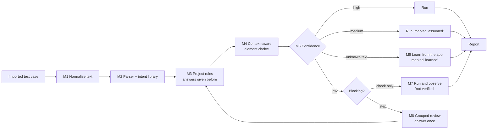

# Auto QA: Handling Real-World Test Cases

| | |
|---|---|
| **Status** | **ADOPTED into [SPEC.md](SPEC.md) (§6.23, D6 revised, D30–D31) on 2026-10-01 and built in phases R1–R5.** Phase status is in §11. The decision numbers in §10 are D30 and D31 in the spec, because D29 was already taken. |
| **Date** | 2026-10-01 |
| **Problem** | In a batch of 10 real OrangeHRM login test cases, all 10 came back NEEDS REVIEW, with about 15 questions. Real test cases are written for people, not machines, and testers will not rewrite them. |
| **Goal** | Run test cases **as testers really write them**. Ask a person only when the meaning is truly unclear, and ask once per wording, not once per test case. |
| **Target** | 90% of real test cases run with no question. Every remaining question is answered once and remembered. |

**Contents**
1. [Why test cases stop today](#1-why-test-cases-stop-today)
2. [Principles (what must not change)](#2-principles-what-must-not-change)
3. [The solution: 10 mechanisms](#3-the-solution-10-mechanisms)
4. [Catalogue of real-world issues](#4-catalogue-of-real-world-issues)
5. [Outcome intents library](#5-outcome-intents-library)
6. [Confidence and decision policy](#6-confidence-and-decision-policy)
7. [New result statuses and report](#7-new-result-statuses-and-report)
8. [The review screen](#8-the-review-screen)
9. [Walk-through: the 10 OrangeHRM cases](#9-walk-through-the-10-orangehrm-cases)
10. [Proposed spec changes](#10-proposed-spec-changes)
11. [Build plan](#11-build-plan)
12. [Questions for the reviewer](#12-questions-for-the-reviewer)

---

## 1. Why test cases stop today

The platform follows decision **D6 "Ask, don't guess"** very strictly. Any unclear word stops the test case. In practice, three causes produce almost all questions:

| Cause | Share in the 10-case batch | Example |
|---|---|---|
| **Wording the parser doesn't know yet** | 6 | "Leave the Login Name text box blank", "Both username and password fields are cleared" |
| **Expected results without exact text** | 3 | "an appropriate error message is displayed" |
| **Element choice confused by the page layout** | 4 (overlaps with the above) | label cell "Password :" vs textbox "Password" |
| **Truly unclear** | 1 | "handles the whitespace according to the application's validation rules" |

Only the last one needs a person.

## 2. Principles (what must not change)

These rules stay. Every mechanism below must respect them.

| # | Rule |
|---|---|
| P1 | **A check is never reported as PASS unless it was actually verified.** |
| P2 | **No silent guesses.** Anything the platform assumed or learned is marked as *assumed* or *learned* in the report and the review screen. |
| P3 | **The platform never invents business behaviour** (§19). It can make a vague check concrete, but it never adds checks the tester didn't ask for. |
| P4 | **A learned value must agree with what the tester asked for.** If the tester expects an error and the app logs the user in, that is a FAIL, never "learned". |
| P5 | **Every automatic decision is explainable and reversible**, either by one click in review or by turning a project rule off. |
| P6 | **Assertions are never auto-healed later** (D10). Learned values are fixed once approved. |

**Proposed change to D6:** *"Ask, don't guess"* becomes *"Ask only when the meaning is truly unclear. Resolve the rest with known rules, learn safely from what the app shows, mark every assumption, and never block a run for wording alone."*

## 3. The solution: 10 mechanisms



| # | Mechanism | What it does | Solves |
|---|---|---|---|
| **M1** | **Text normaliser** | Before parsing: unify quotes (“ ” ‘ ’ → " '), bullets and numbering, spaces; expand abbreviations (pwd → password, btn → button, txt box → text box, DDL → dropdown); fix spelling against the page's own words (Usename → Username) | Typing and formatting noise |
| **M2** | **Parser rules + outcome intents** | Knows normal QA wording ("Leave X blank", "Both X and Y", "home/dashboard page", "login is rejected"). Vague *outcome* phrases map to concrete intents (§5). | Most "cannot tell what to do" and "too general" questions |
| **M3** | **Project rules (teach once)** | Every answer the tester gives in review becomes a project rule: phrase → meaning, word → element, page alias. The same wording is never asked about again. | Repeated questions across a batch and across imports |
| **M4** | **Context-aware element choice** | Label-and-field merging, role filtering by check type, section scope, page vocabulary, synonyms | "More than one element matches" |
| **M5** | **Learn from the app** | When the tester didn't give the exact text ("an appropriate error message"), exploration records what the app showed and turns it into a concrete check, marked *learned*, only if it fits the intent (P4) | Unknown messages, toast texts, page names |
| **M6** | **Confidence and policy** | Every decision gets a confidence. A project setting (strict / balanced / lenient) decides what runs automatically, what runs as "assumed", and what is asked (§6). | One rule for everything |
| **M7** | **Run and observe** | An unclear *check* no longer blocks the test. The steps run, other checks are verified, and the unclear check is reported as **NOT VERIFIED** with what was observed. | Truly vague expected results |
| **M8** | **Grouped review** | Questions are grouped by reason across the whole batch: "4 test cases use 'Leave X blank'". One answer fixes all, and is saved as a rule (M3). | Answering the same thing 4 times |
| **M9** | **Import repair** | Multi-row steps, per-step expected results, merged cells, "Same as TC_001", "Repeat steps 1–3", data placeholders `<username>` | Spreadsheet layout problems |
| **M10** | **Rewrite suggestion** | For every test case that needed help, the results workbook gets a column "Suggested wording" with a clean version of each step and check | Improves test cases over time, without forcing anyone |

Optional, decided later (FR-AI): a local AI helper as the last step before asking a person. Its suggestions go through M6 like everything else.

## 4. Catalogue of real-world issues

**Result** column: ✅ runs automatically · 🟡 runs, marked *assumed* · 🔵 runs, value *learned* · ⚪ runs, check *not verified* · ❓ asked once (grouped, then remembered)

### 4.1 Step wording

| ID | Issue | Example | Solution | Result |
|---|---|---|---|---|
| RW-S01 | Filler adverbs | "Successfully click Login" | M2: remove filler when a real action/check remains | ✅ |
| RW-S02 | "Leave / keep empty" | "Leave the Login Name text box blank"; "Keep password empty"; "Do not enter username" | M2: `clear` the field (or no action if it starts empty), plus a note | ✅ |
| RW-S03 | Several actions in one step | "Enter username and password and click Login" | M2: split on "and/then" when each part has an action word | ✅ |
| RW-S04 | Action + data in the sentence | "Enter *Admin* as username"; "Enter username (Admin)" | M2: value from quotes, "as", brackets, or the Test Data column | ✅ |
| RW-S05 | Vague data words | "Enter valid username" | Existing data binding → `TEST_USERNAME`; if no such secret: ask once per project | ✅ / ❓ |
| RW-S06 | Data placeholders | "Enter `<username>`", `{username}`, `[username]` | M1/M9: treat as data key | ✅ |
| RW-S07 | UI-type words | "text box", "textbox", "txt", "drop down", "DDL", "radio btn", "link text" | M1: abbreviations → role hint | ✅ |
| RW-S08 | Spelling mistakes | "Usename", "pasword", "Logn" | M1: fuzzy match against the page's own words and the lexicon (distance ≤ 2, word length ≥ 5) | 🟡 |
| RW-S09 | Setup steps that are not actions | "Open browser", "Launch the application" | Existing: "Open browser" = no step; "Launch the application" = open BASE_URL | ✅ |
| RW-S10 | Reference to other steps | "Repeat steps 1–3"; "Same as TC_LOGIN_001" | M9: expand into those steps | ✅ |
| RW-S11 | Passive voice | "Login button is clicked"; "Username is entered" | M2: passive patterns → action | ✅ |
| RW-S12 | "Should" in steps | "User should click Login" | M2: drop "user should" | ✅ |
| RW-S13 | Conditional step | "If a cookie banner appears, accept it" | M2 + runtime: optional step (runs only if the element is there) | ✅ |
| RW-S14 | Waiting steps | "Wait for the page to load"; "Wait 5 seconds" | Page-load wait (automatic); fixed waits become "wait until the page is idle" with a note | ✅ |
| RW-S15 | Keyboard / mouse wording | "Hit Enter", "Tab to Password", "Double-click the row", "Right-click" | M2: lexicon | ✅ |
| RW-S16 | Truly unclear step | "Do the needful", "Complete the process" | M8: ask once | ❓ |

### 4.2 Expected result wording

| ID | Issue | Example | Solution | Result |
|---|---|---|---|---|
| RW-E01 | Filler around a real check | "User is **successfully** redirected to the Dashboard" | M2: remove filler, keep "redirected to Dashboard" | ✅ |
| RW-E02 | Alternatives with "/" or "or" | "home/dashboard page"; "Dashboard or Home" | M2: either name is accepted (page alias) | ✅ |
| RW-E03 | Outcome phrases | "Login is rejected", "User is not logged in", "Access is denied", "User is logged out" | §5 intents → concrete checks | ✅ |
| RW-E04 | Message without exact text | "an appropriate error message is displayed" | §5 intent ERROR_SHOWN + M5 learn the text | 🔵 |
| RW-E05 | Several checks in one sentence | "Login is rejected **and** an error is displayed" | M2: split on "and" into separate checks | ✅ |
| RW-E06 | "Both X and Y …" / lists | "Both username and password fields are cleared" | M2: one check per element | ✅ |
| RW-E07 | Look/feel words | "password is displayed as masked characters"; "text is hidden" | M2: masked → `type=password` (VAL-B14) | ✅ |
| RW-E08 | Conditional expectation | "…should display an error **if** spaces are not accepted" | M7: run, report what happened, NOT VERIFIED | ⚪ |
| RW-E09 | Behaviour description | "The system handles the whitespace according to the rules" | M7 | ⚪ |
| RW-E10 | "Should not" wording | "User should not be able to log in" | M2: negated LOGIN_SUCCESS = LOGIN_REJECTED | ✅ |
| RW-E11 | Expected in the Steps column | Step 5: "Dashboard should be shown" | Existing: "should/observe/verify" steps are checks | ✅ |
| RW-E12 | Per-step expected results | Excel has "Expected" next to each step | M9: each becomes a check after its step | ✅ |
| RW-E13 | Empty or "N/A" expected result | Expected: "N/A" | Only guard rails run; status NOT VERIFIED with "no expected result given" | ⚪ |
| RW-E14 | Things the UI cannot show | "Data is saved in the database"; "Email is sent" | M7: NOT VERIFIED with reason "not visible in the UI"; later: API/DB checks (VAL-R) | ⚪ |
| RW-E15 | Exact message with small differences | Expected "Invalid credentials", app shows "Invalid Credentials." | Text match ignores case, trailing punctuation and extra spaces, marked *assumed* if they differ | 🟡 |
| RW-E16 | Message in another wording | Expected "Wrong password", app shows "Invalid credentials" | **FAIL** with both texts shown. Never assumed (P4). A project rule can accept it ("treat as equal"). | FAIL / ❓ |

### 4.3 Finding the element

| ID | Issue | Example | Solution | Result |
|---|---|---|---|---|
| RW-L01 | Label in a separate table cell | cell "Password :" + textbox "Password" | M4: a label cell/text right before a field is merged with the field | ✅ |
| RW-L02 | The check type decides the element type | "masked", "cleared", "empty" | M4: only text fields; "selected" → dropdown/radio; "clicked" → button/link | ✅ |
| RW-L03 | Tester's word ≠ the screen's word | "Login Name" vs field "Username"; "Sign in" vs "Login" | Synonyms + fuzzy + M3 aliases; if still unsure → ❓ once, remembered | ✅ / ❓ |
| RW-L04 | Same text twice on the page | Two "Save" buttons | M4: prefer the one in the section the step names, the one in the active dialog, or the visible one; else ❓ | ✅ / ❓ |
| RW-L05 | Element words inside a long sentence | "Login is rejected and an appropriate…" was read as an element name | M2: outcome phrases are found **before** element extraction | ✅ |
| RW-L06 | Field with only a placeholder | input with placeholder "Email" | Existing ladder: `getByPlaceholder` | ✅ |
| RW-L07 | Icon button without a name | ✕, ☰, 🔍 | M4: icon dictionary (title, aria-label, class names like `close`, `search`, `menu`); else ❓ | 🟡 / ❓ |
| RW-L08 | Element inside an iframe | payment form, embedded editor | Explorer searches frames; locator via `frameLocator` | ✅ |
| RW-L09 | Element appears only after hover/scroll | menu item, lazy list | Explorer hovers the parent menu / scrolls before giving up | ✅ |
| RW-L10 | Position words | "first row", "last item", "second Delete button" | M2: `.first()`, `.last()`, `.nth(1)` | ✅ |

### 4.4 The application at run time

| ID | Issue | Example | Solution | Result |
|---|---|---|---|---|
| RW-R01 | Cookie banner / pop-up / tour | "Accept cookies", "What's new" | Known-overlay handler: dismiss if it blocks the target, record it | ✅ |
| RW-R02 | Slow page, spinners | | Page-idle and spinner-gone wait (VAL-E09) | ✅ |
| RW-R03 | Unexpected browser dialog | "Leave site?" | Dismiss and record; FAIL only if the test expects otherwise | ✅ |
| RW-R04 | **Account locks after failed logins** | 3 negative login tests lock the test user | Run negative login tests with a separate disposable user, or put them after the positive ones; warn when the batch has more than N wrong-password tests for one user | ✅ / ⚠ |
| RW-R05 | Test depends on another test's data | "Edit the user created in TC_005" | Dependency detection → run order, or a precondition flow | ✅ |
| RW-R06 | Data already exists | "Register a new user" passes once, fails the second time | Unique data generators (FR-TD-04) | ✅ |
| RW-R07 | Session expires in a long batch | | Re-login through the saved login flow | ✅ |
| RW-R08 | Environment down | | BLOCKED, never FAIL (FR-VAL-05) | ✅ |
| RW-R09 | CAPTCHA / OTP | | BLOCKED with "switch off CAPTCHA/OTP in the test environment" | BLOCKED |

### 4.5 Spreadsheet layout

| ID | Issue | Example | Solution | Result |
|---|---|---|---|---|
| RW-I01 | One step per row | TC ID only on the first row, steps below | M9: group rows until the next ID | ✅ |
| RW-I02 | Merged cells | Title merged over 5 rows | M9: un-merge, copy the value down | ✅ |
| RW-I03 | Different column names | "Test Steps", "Procedure", "Expected Outcome" | Existing automatic column matching (FR-IN-09) | ✅ |
| RW-I04 | Preconditions inside the steps | "1. User is on the login page" | M2: a first step that describes a state becomes a precondition | ✅ |
| RW-I05 | Several sheets | One sheet per module | Import all sheets or chosen ones | ✅ |
| RW-I06 | Duplicate test case IDs | Two TC_LOGIN_003 | Warn; suffix `-2` | 🟡 |
| RW-I07 | Empty or decorative rows | Section headers like "LOGIN MODULE" | Skip rows without steps; use them as a module tag | ✅ |

## 5. Outcome intents library

Testers describe outcomes, not checks. An **intent** turns a common outcome phrase into concrete checks. The parts the tester didn't specify are *learned* from the app (M5), always under rule P4.

| Intent | Phrases (examples) | Concrete checks | Learned part | Fails when |
|---|---|---|---|---|
| **LOGIN_SUCCESS** | "successfully logged in", "redirected to home/dashboard", "user is able to log in" | not on the login page; on the named page if given; user menu / logout visible | Post-login page name and key element | Still on login, or error shown |
| **LOGIN_REJECTED** | "login is rejected", "login fails", "user is not logged in", "should not be able to log in" | stays on the login page; no post-login element | — | User reaches the post-login page |
| **ERROR_SHOWN** | "an appropriate / proper / relevant error message is displayed", "validation message is shown" | a new error-like message appears after the action (role alert, aria-invalid, error/invalid class, red text, near the field) | **The message text** | No new message appears |
| **FIELD_ERROR** | "error shown for username", "required message under password" | ERROR_SHOWN placed at or under that field | Message text | Message missing or at another field |
| **SUCCESS_SHOWN** | "success message is displayed", "record saved successfully" | a new success-like message or toast appears | Message text | No message, or an error message appears |
| **FIELD_CLEARED** | "fields are cleared", "fields are reset", "form is empty" | each named field (or every field in the form) is empty | — | A field still has a value |
| **MASKED** | "password is masked", "shown as dots/asterisks", "characters are hidden" | field `type=password` | — | Field shows plain text |
| **STAYS** | "user stays on the page", "page does not change", "nothing happens" | URL unchanged; no new page | — | URL changes |
| **NAVIGATED** | "navigated to X", "X page opens", "redirected to X" | page identity of X (VAL-A05) | Page fingerprint | Another page |
| **ACCESS_DENIED** | "access is denied", "user cannot open X" | not on X; redirected to login or an access-denied message | Message text (optional) | X opens |
| **LOGGED_OUT** | "user is logged out", "session ends" | on the login page; Back does not show protected content | — | Protected page still shown |
| **DISABLED_UNTIL** | "button is disabled until fields are filled" | disabled before, enabled after | — | Enabled too early |
| **LIST_CONTAINS** | "the new record is displayed in the list" | row/item with the entered value exists | — | Not found |
| **NO_CHANGE** | "data is not saved" | after reload, the value is the old one | — | Value changed |

**How learning works (M5), example ERROR_SHOWN:**
1. Just before the action, the explorer records the messages on the page.
2. After the action, it looks for **new** messages that look like errors: role `alert`, `aria-invalid`, classes containing `error|invalid|danger|alert`, red text, text near the field.
3. Exactly one fits → it becomes `Error "Invalid credentials" is shown`, marked **learned**. In the generated test it is a normal text check, so later runs verify that exact text.
4. None fit → **FAIL** during exploration: "Expected an error message, none appeared" (possible real defect, shown in review).
5. Several fit → all are kept if they are all errors; else ❓.

## 6. Confidence and decision policy

Every decision the platform makes gets a confidence level:

| Level | Meaning | Examples |
|---|---|---|
| **Certain** | Exact rule or exact match | "Click Login" → button "Login" |
| **High** | Known pattern, one clear candidate | "Leave Username blank"; label cell merged with its field |
| **Medium** | Fuzzy or learned | Spelling fix "Usename" → "Username"; learned error text |
| **Low** | Two candidates close together, or no pattern | Two "Save" buttons; "handles whitespace…" |

A **project setting** chooses what happens at each level:

| Policy | Certain / High | Medium | Low step | Low check |
|---|---|---|---|---|
| **Strict** (today) | run | ask | ask | ask |
| **Balanced** (proposed default) | run | run, marked *assumed / learned* | ask (grouped) | run, NOT VERIFIED |
| **Lenient** | run | run | best candidate if ≥ 60%, marked *assumed* | run, NOT VERIFIED |

**Blocking vs non-blocking:** an unclear **step** blocks that test case, because the next steps depend on it. An unclear **check** never blocks; it runs as NOT VERIFIED (M7).

## 7. New result statuses and report

| Status | Meaning | Counts as passed? |
|---|---|---|
| PASS | Every check verified and passed | Yes |
| **PASS (with assumptions)** | Passed, but some decisions were *assumed* or *learned*. Listed in the report. | Yes, flagged for a one-time look |
| **NOT VERIFIED** (new) | Steps ran without failure, but at least one check couldn't be verified. Shows what was observed. | **No** |
| FAIL | A check failed or the application broke | No |
| BLOCKED | Couldn't run: environment, credentials, CAPTCHA | No |
| NEEDS REVIEW | A **step** is unclear, so the test couldn't run | No |

Example report lines:

```
TC_LOGIN_002  PASS (with assumptions)
  A1  User stays on the Login page                         ✔
  A2  Error "Invalid credentials" is shown                 ✔  learned from the app (wording: "appropriate … error message")

TC_LOGIN_010  NOT VERIFIED
  A1  "handles the whitespace according to …"              ⚪ not verified
      Observed: user was logged in and reached /dashboard. Was that correct?  [Correct → save as check] [Wrong → mark FAIL]
```

Answering "Correct" on a NOT VERIFIED line turns the observation into a real check for future runs.

## 8. The review screen

One screen for the whole batch, grouped by reason:

```
Batch: OrangeHRM Login (10 test cases)   ✔ 8 ready   🟡 1 assumed   ⚪ 1 not verified   ❓ 1 question

❓ 1 question (affects 4 test cases)
   "Leave the Login Name text box blank"   TC_005, TC_007 (+2)
   → Means: clear the field [Login Name = textbox "Username"]   [Yes, remember for this project]  [Change]

🔵 Learned values (3)   [Approve all]
   TC_002, TC_003, TC_004: Error "Invalid credentials"

🟡 Assumptions (1)   [Approve all]
   TC_008: "password" → textbox "Password" (label cell "Password :" merged)
```

- **Approve all** approves every item in a group.
- Every answer is saved as a project rule (M3). A "Project rules" page lists them, so they can be edited or switched off.
- The batch keeps running while questions wait. Only the affected test cases wait.

## 9. Walk-through: the 10 OrangeHRM cases

| Case | Today | With the proposal | Mechanisms |
|---|---|---|---|
| TC_LOGIN_001 Valid login | ❓ "successfully" too general | ✅ LOGIN_SUCCESS → on Dashboard ("home/dashboard" = either) | M2, RW-E01, RW-E02 |
| TC_LOGIN_002 Invalid username | ❓ 3 elements match | 🔵 LOGIN_REJECTED + ERROR_SHOWN, text learned "Invalid credentials" | M2, M5, RW-L05 |
| TC_LOGIN_003 Invalid password | ❓ not found | 🔵 same as 002 | M2, M5 |
| TC_LOGIN_004 Both invalid | ❓ 46% match | 🔵 same as 002 | M2, M5 |
| TC_LOGIN_005 Blank username | ❓ no action word | ✅ "Leave … blank" → clear; then the expected check | M2 RW-S02 |
| TC_LOGIN_006 Blank password | ❓ no action word | ✅ same | M2 RW-S02 |
| TC_LOGIN_007 Both blank | ❓ ×2 | ✅ same | M2 RW-S02 |
| TC_LOGIN_008 Password masked | ❓ ×3 two elements | ✅ MASKED → textbox "Password" `type=password` (label cell merged; the 3 checks become 1) | M2, M4 RW-L01, RW-L02 |
| TC_LOGIN_009 Clear button | ❓ two elements | ✅ FIELD_CLEARED → Username and Password are empty | M2 RW-E06, M4 |
| TC_LOGIN_010 Spaces | ❓ ×2 | ⚪ runs; NOT VERIFIED with what was observed | M7 |
| **Total** | **0 run, ~15 questions** | **9 run, 1 not verified, 0–1 questions** | |

Also: TC_002–004 are three wrong-password logins for the same user. RW-R04 warns if the app locks accounts.

These 10 cases become the **acceptance test** for this proposal: the batch must give this result.

## 10. Proposed spec changes

To be added to [SPEC.md](SPEC.md) after review. IDs are provisional.

| Area | Change |
|---|---|
| Decisions | **D6 revised** (see §2). New **D30** confidence policy (strict / balanced / lenient, default balanced). New **D31** learned values must agree with the tester's intent (P4). |
| Parser (FR-PA) | FR-PA-14 text normaliser (M1) · FR-PA-15 compound steps/checks split · FR-PA-16 "leave/keep blank" · FR-PA-17 passive voice and "user should" · FR-PA-18 outcome intents library (§5) · FR-PA-19 step references ("Repeat steps 1–3", "Same as TC_x") · FR-PA-20 conditional/optional steps · FR-PA-21 position words |
| Locators (FR-LO) | FR-LO-14 label-and-field merging · FR-LO-15 element type from the check type · FR-LO-16 icon dictionary · FR-LO-17 iframes, hover menus, lazy lists |
| Learning (new FR-LRN) | FR-LRN-01 learn message texts (M5) · FR-LRN-02 learn page names and fingerprints · FR-LRN-03 learned values marked and approvable |
| Project rules (new FR-RULE) | FR-RULE-01 every review answer saved as a rule · FR-RULE-02 rules page (list, edit, switch off) · FR-RULE-03 rules export/import between projects |
| Review (FR-RV) | FR-RV-07 grouped review for a batch · FR-RV-08 approve all per group · FR-RV-09 batch keeps running while questions wait |
| Results (FR-VAL) | FR-VAL-11 NOT VERIFIED status with observation · FR-VAL-12 PASS (with assumptions) · FR-VAL-13 "observed → save as check" |
| Import (FR-IN) | FR-IN-10 one step per row, merged cells, per-step expected, section rows, several sheets |
| Runtime (FR-EX/FR-RUN) | FR-EX-11 known-overlay handler · FR-RUN-11 account lock-out guard · FR-RUN-12 dependency order between test cases |
| Results workbook (FR-HI) | FR-HI-08 "Suggested wording" column (M10) |

## 11. Build plan

| Phase | Builds | Result on the OrangeHRM batch |
|---|---|---|
| **R1** Parser and element fixes ✅ | M1, M2 (RW-S01…S15, RW-E01…E07, E10…E12), M4 (RW-L01, L02, L05; L10 position words moved to R5) | built: the wording of 9 of 10 is understood |
| **R2** Intents and learning ✅ | §5 intents (the ones the benchmark needs), M5 learning of error texts, PASS (with assumptions) | built: 9 of 10 run |
| **R3** Non-blocking ✅ | M7 NOT VERIFIED, M6 policy setting (strict, balanced, lenient) | built: **10 of 10 run (9 PASS, 1 NOT VERIFIED), 0 questions**. This is the acceptance test, `src/realworld/realworld.test.ts` |
| **R4** Review and rules | M8 grouped review, M3 project rules, rules page | Remaining questions asked once |
| **R5** Import and runtime | M9 import repair, RW-R01…R07, M10 suggested wording | Messy spreadsheets and long batches |

Each phase ships with tests built from real test cases. The OrangeHRM batch is the first fixture, and every new real-world case that fails gets added.

## 12. Questions for the reviewer

| # | Question | Proposed answer |
|---|---|---|
| 1 | Default policy for new projects? | **Balanced** |
| 2 | Should PASS (with assumptions) count as passed in summaries and in the results workbook? | Yes, with the assumptions listed |
| 3 | Should learned values need approval before the first real run, or only be shown? | Shown, with **Approve all**. The first run uses them. |
| 4 | Spelling correction (RW-S08): on by default? | Yes, only for words of 5+ letters, at most 2 letters different |
| 5 | Lenient policy: allow picking the best of two close candidates? | Only if you want it. Not the default. |
| 6 | Project rules: shared with the team later (V3), or personal? | Shared per project |
| 7 | Account lock-out guard: how many wrong-password tests per user before warning? | 3 (configurable) |
