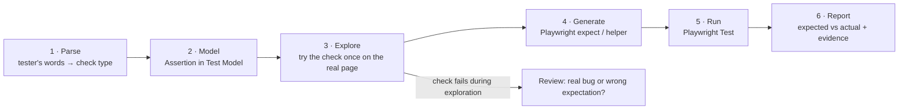

# Auto QA: Validation Catalogue

Part of [SPEC.md](SPEC.md) (§6.12 FR-VAL) and [ARCHITECTURE.md](ARCHITECTURE.md). This document lists **every kind of check** the platform can make, how a tester writes it, how it becomes Playwright code, what the report shows when it fails, and when it gets built.

**Status legend:** ✅ built and tested · V1 / V2 / V3 / V4 = planned version · Backlog = idea, not scheduled

**Update 2026-10-01 (M9):** the validation registry (`src/validations/`) is built. Each ✅ row marked "built (M9)" is understood by the parser (its examples are tested one by one in `src/validations/validations.test.ts`), found on the page during exploration, written as Playwright code, run by the matchers in the generated project (`utils/matchers.ts`) and reported with "Expected" and "Actual". The end-to-end test `src/validations/e2e.test.ts` runs most of them against a real page, passing and failing. The list of what is **not** built yet, and why, is in [§9](#9-not-built-yet).

**Contents**
1. [Three layers of validation](#1-three-layers-of-validation)
2. [How a validation works in the project](#2-how-a-validation-works-in-the-project)
3. [The catalogue](#3-the-catalogue): A. Page and navigation · B. Element state · C. Text and content · D. Forms and input · E. Messages, dialogs, loading · F. Layout and visual · G. Tables and lists · H. Network · I. Health and errors · J. Login, session, security · K. Storage and state · L. Accessibility · M. Performance · N. Files · O. Data correctness · P. Timing and dynamic content · Q. Cross-browser and devices · R. API and back end
4. [Automatic checks on every step](#4-automatic-checks-on-every-step-guard-rails)
5. [Quality gates (suite-level scans)](#5-quality-gates-suite-level-scans)
6. [Rules that keep validations stable](#6-rules-that-keep-validations-stable)
7. [Changes to the Test Model](#7-changes-to-the-test-model)
8. [Build order](#8-build-order)

---

## 1. Three layers of validation

| Layer | Who decides | Example | Reported as |
|---|---|---|---|
| **1. Explicit checks** | The tester, in the Expected Result column or a "Verify…" step | "Error *This email is already registered* is shown" | The test's own PASS / FAIL |
| **2. Automatic guard rails** | The platform, on every step | "After Open Home page, the browser really is on the Home page"; "no crash" | A separate **Health** line. A failure makes the test FAIL with a clear reason. |
| **3. Quality gates** | The project owner, per suite | Accessibility scan, broken links, page speed, visual comparison | A separate **Quality** section. Can warn or fail. |

**Rule from §19 of the requirements:** the platform never adds *business* expectations the tester didn't write. Layers 2 and 3 are technical guard rails (did the page load, did it crash). They are always reported separately from the tester's expected result, and each one can be switched off.

## 2. How a validation works in the project

Every validation goes through the same six stages:



| Stage | What happens | Where in the code |
|---|---|---|
| 1 Parse | Phrase patterns turn words into a check type ("is shown" → `visible`, "redirected to" → `url`, "in the middle" → `layout`) | `src/parser/assertions.ts` |
| 2 Model | The check is stored with its target, expected value, options (tolerance, count operator…) and `negated` | `src/model/test-model.ts` |
| 3 Explore | The platform finds the target element, and runs the check once with the Locator Probe. If it already fails, the tester is asked: *"Expected Dashboard heading, but it is not on the page. Real bug, or wrong expectation?"* | `src/explorer/controller.ts`, `src/locators/probe.ts` |
| 4 Generate | Each check type has one code template. Checks that Playwright doesn't have built in become **custom matchers** in the generated project (`utils/matchers.ts`), so the test stays readable. | `src/generator/plan.ts` |
| 5 Run | Playwright's web-first assertions wait automatically (default 5 s). No fixed sleeps. | generated project |
| 6 Report | The reporter fills in *Expected / Actual / Step / Evidence* from the assertion error and the captured page facts | `src/results/` |

### 2.1 Validation registry (design)

Each check type is one module, so adding a new validation never touches the other code:

```ts
// src/validations/registry.ts (planned)
export interface ValidationType<O = unknown> {
  type: string;                                  // 'layout-centered'
  phrases: RegExp[];                             // /in the (middle|centre|center) of the (screen|page)/i
  parse(match: RegExpMatchArray, text: string): O;      // → options for the model
  needsTarget: boolean;                          // does it check an element?
  probe(page: Page, locator: Locator | null, o: O): Promise<ProbeResult>;  // stage 3
  generate(target: string | null, o: O, negated: boolean): CodeLines;      // stage 4
  describeActual(error: Error, facts: PageFacts): string;                  // stage 6
  version: 'V1' | 'V2' | 'V3' | 'V4';
}
```

### 2.2 Custom matchers in the generated project

```ts
// generated: utils/matchers.ts
export const expect = baseExpect.extend({
  async toBeCentered(locator: Locator, opts: { axis?: 'x' | 'y' | 'both'; tolerance?: number } = {}) {
    const { axis = 'x', tolerance = 0.05 } = opts;
    const box = await locator.boundingBox();
    const vp = locator.page().viewportSize()!;
    if (!box) return { pass: false, message: () => 'Element is not visible, so its position cannot be checked' };
    const dx = Math.abs(box.x + box.width / 2 - vp.width / 2);
    const dy = Math.abs(box.y + box.height / 2 - vp.height / 2);
    const okX = dx <= vp.width * tolerance, okY = dy <= vp.height * tolerance;
    const pass = axis === 'x' ? okX : axis === 'y' ? okY : okX && okY;
    return {
      pass,
      message: () => `Expected centred (${axis}, ±${tolerance * 100}%). Actual: ${Math.round(dx)} px off horizontally, ${Math.round(dy)} px off vertically, screen ${vp.width}×${vp.height}`,
    };
  },
  // toBeBelow, toBeAbove, toBeLeftOf, toBeRightOf, toBeAlignedWith, toNotOverlap,
  // toBeInRegion, toBeSortedBy, toHaveNoA11yViolations, toLoadWithin …
});
```

### 2.3 Options every check can have

| Option | Meaning | Example |
|---|---|---|
| `negated` | The opposite check | "Error is **not** shown" |
| `soft` | Keep going after a failure, report all failures at the end (`expect.soft`) | Checking 10 labels on one form |
| `timeout` | Wait longer than the default | "Report is generated **within 30 seconds**" |
| `severity` | `fail` (default) or `warn` | Quality gates often start as `warn` |
| `scope` | Look only inside a region | "**In the Login form**, the Email field is empty" |

---

## 3. The catalogue

Columns: **Tester writes** = example wording the parser understands. **Check** = the Playwright code. **Actual on failure** = what the report shows.

### A. Page and navigation

| ID | Validation | Tester writes | Check | Actual on failure | Status |
|---|---|---|---|---|---|
| VAL-A01 | URL contains / matches | "User is redirected to /dashboard" | `expect(page).toHaveURL(/\/dashboard/)` | Current URL | ✅ |
| VAL-A02 | On a named page | "User is on the Dashboard page" | `expectPath(page, DashboardPage.path)` | Current path + expected path | ✅ |
| VAL-A03 | Stays on the same page | "User remains on the Login page" | `expectPath(page, LoginPage.path)` | Where the browser went | ✅ |
| VAL-A04 | Page title | "Page title is *Swag Labs*" | `expect(page).toHaveTitle('Swag Labs')` | Current title | ✅ built (M9) |
| VAL-A05 | **Page identity** (URL + title + key element) | "Home page is displayed" | `expectOnPage(page, homePage)` → path, title, key element visible | Which of the three failed | V1 · also automatic (§4) |
| VAL-A06 | Query parameter / hash | "URL has *?tab=profile*" | `expect(new URL(page.url()).searchParams.get('tab')).toBe('profile')` | Actual parameter value | ✅ built (M9) |
| VAL-A07 | Document HTTP status | "Page opens without error" / automatic | `const r = await page.goto(...); expect(r!.status()).toBeLessThan(400)` | Status code | V1 (automatic) |
| VAL-A08 | New tab / pop-up opened | "Help opens in a new tab with URL /help" | `const popup = await page.waitForEvent('popup'); await expect(popup).toHaveURL(/\/help/)` | No new tab / its URL | ✅ built (M9) |
| VAL-A09 | Link target | "Terms link points to /terms" | `expect(link).toHaveAttribute('href', /\/terms/)` | Actual href | ✅ built (M9) |
| VAL-A10 | External link opens safely | "Opens in new tab" | `toHaveAttribute('target', '_blank')` + `rel` contains `noopener` | Attributes | ✅ built (M9) |
| VAL-A11 | Back/forward behaviour | "After Back, user is on Home" | `page.goBack()` then VAL-A02 | Current page | ✅ (back/forward steps) |
| VAL-A12 | Reload keeps state | "After refresh, cart still shows 2" | `page.reload()` then the state check | State after reload | ✅ built (M9) |
| VAL-A13 | Breadcrumb / active menu item | "Profile tab is selected" | `expect(tab).toHaveAttribute('aria-selected', 'true')` or `toHaveClass(/active/)` | Current attributes | ✅ built (M9) |

### B. Element presence and state

| ID | Validation | Tester writes | Check | Actual on failure | Status |
|---|---|---|---|---|---|
| VAL-B01 | Visible | "Dashboard heading is displayed" | `toBeVisible()` | Not found / hidden / covered | ✅ |
| VAL-B02 | Hidden / not shown | "Error is not shown" | `not.toBeVisible()` | It is visible, with its text | ✅ |
| VAL-B03 | Exists / removed from page | "Item is removed from the list" | `toBeAttached()` / `not.toBeAttached()` | Still in the page | ✅ built (M9) |
| VAL-B04 | Enabled | "Login button is enabled" | `toBeEnabled()` | Disabled | ✅ |
| VAL-B05 | Disabled | "Submit is disabled" | `toBeDisabled()` | Enabled | ✅ |
| VAL-B06 | Editable / read-only | "Email field is read-only" | `not.toBeEditable()` | Editable | ✅ built (M9) |
| VAL-B07 | Checked / unchecked / radio selected | "Remember me is checked" | `toBeChecked()` / `not.toBeChecked()` | Current state | ✅ |
| VAL-B08 | Focused | "Cursor is in the Email field" | `toBeFocused()` | Which element has focus | ✅ built (M9) |
| VAL-B09 | Count | "6 products are shown"; "at least 1 result" | `toHaveCount(6)`; `expect(await l.count()).toBeGreaterThanOrEqual(1)` | Actual count | ✅ built (M9) |
| VAL-B10 | Empty | "Search box is empty"; "Cart is empty" | `toBeEmpty()` / `toHaveValue('')` | Current content | ✅ built (M9) |
| VAL-B11 | Visible without scrolling | "Login button is visible without scrolling" | `toBeInViewport()` | Element position vs screen | ✅ built (M9) |
| VAL-B12 | Clickable (not covered) | "Login button can be clicked" | `locator.click({ trial: true })` | What covers it | ✅ built (M9) |
| VAL-B13 | Expanded / collapsed | "FAQ answer is expanded" | `toHaveAttribute('aria-expanded', 'true')` | Current state | ✅ built (M9) |
| VAL-B14 | Element type | "Password field hides characters" | `toHaveAttribute('type', 'password')` | Actual type | ✅ built (M9) |

### C. Text and content

| ID | Validation | Tester writes | Check | Actual on failure | Status |
|---|---|---|---|---|---|
| VAL-C01 | Text shown on page | "Message *Welcome back* is shown" | `expect(page.getByText('Welcome back').first()).toBeVisible()` | Similar texts on page | ✅ |
| VAL-C02 | Text not shown | "*Invalid password* is not shown" | `toHaveCount(0)` | Where it appeared | ✅ |
| VAL-C03 | Element has exact text | "Heading text is *Products*" | `toHaveText('Products')` | Actual text | ✅ built (M9) |
| VAL-C04 | Element contains text | "Banner contains *50% off*" | `toContainText('50% off')` | Actual text | ✅ built (M9) |
| VAL-C05 | Text pattern | "Order number looks like *ORD-######*" | `toHaveText(/^ORD-\d{6}$/)` | Actual text | ✅ built (M9) |
| VAL-C06 | List of texts in order | "Menu items are Home, About, Contact" | `toHaveText(['Home','About','Contact'])` | Actual list | ✅ built (M9) |
| VAL-C07 | Field value | "Email field shows *a@b.com*" | `toHaveValue('a@b.com')` | Actual value | ✅ |
| VAL-C08 | Dropdown selected option | "Country shows *India*" | `toHaveValue(...)` or selected option text | Selected option | ✅ (value) · V1 (option text) |
| VAL-C09 | Dropdown option list | "Country options are India, USA, UK" | `expect(select.locator('option')).toHaveText([...])` | Actual options | ✅ built (M9) |
| VAL-C10 | Placeholder | "Email placeholder is *Enter email*" | `toHaveAttribute('placeholder', 'Enter email')` | Actual placeholder | ✅ built (M9) |
| VAL-C11 | Tooltip | "Hovering Info shows *Your data is safe*" | hover, then `getByRole('tooltip')` `toHaveText` | Tooltip text / none | ✅ built (M9) |
| VAL-C12 | Attribute value | "Logo alt text is *Company logo*" | `toHaveAttribute('alt', 'Company logo')` | Actual attribute | ✅ built (M9) |
| VAL-C13 | Accessible name / description | "Close button is named *Close*" | `toHaveAccessibleName('Close')` | Actual name | ✅ built (M9) |
| VAL-C14 | Number/currency/date format | "Price is shown as *$29.99*"; "Date is DD/MM/YYYY" | `toHaveText(/^\$\d+\.\d{2}$/)`, date regex | Actual text | ✅ built (M9) |
| VAL-C15 | Today's date / dynamic value | "Order date is today" | compare with `{{today}}` in the project's date format | Actual date | ✅ built (M9) |
| VAL-C16 | Language / translation | "Labels are in German" | text from a language data file per locale | Actual text | V3 |
| VAL-C17 | Text not cut off | "Product name is not truncated" | `evaluate(el => el.scrollWidth <= el.clientWidth)` | Widths | ✅ built (M9) |

### D. Forms and input validation

| ID | Validation | Tester writes | Check | Actual on failure | Status |
|---|---|---|---|---|---|
| VAL-D01 | Required-field error | "Error *Email is required* is shown" | VAL-C01 (or the error linked to the field, D04) | Messages on page | ✅ (as text) |
| VAL-D02 | Format error (email, phone, postcode) | Data `Email=abc` + "Error *Enter a valid email*" | same | same | ✅ (as text) |
| VAL-D03 | Field marked invalid | "Email field is marked invalid" | `toHaveAttribute('aria-invalid', 'true')` or `evaluate(el => !el.checkValidity())` | Current state | ✅ built (M9) |
| VAL-D04 | Error belongs to the right field | "Error *Required* is shown **for Email**" | `toHaveAccessibleErrorMessage('Required')` / `aria-describedby`, fallback: error is the nearest message below the field (VAL-F05) | Which field the error is next to | ✅ built (M9) |
| VAL-D05 | Browser's own validation message | "Browser asks to fill the Email field" | `evaluate(el => el.validationMessage)` | Actual message | ✅ built (M9) |
| VAL-D06 | Maximum length | "Username accepts at most 20 characters" | type 21 chars → `expect((await f.inputValue()).length).toBe(20)`; or `toHaveAttribute('maxlength','20')` | Actual length | ✅ built (M9) |
| VAL-D07 | Minimum / boundary values | "Password with 7 characters shows *Min 8*" | data-driven rows (FR-TD-05) + message check | Message | V2 |
| VAL-D08 | Error clears after fixing | "After entering a valid email, the error disappears" | `not.toBeVisible()` after the fill | Error still shown | V1 (negated visible) |
| VAL-D09 | Submit disabled until valid | "Submit stays disabled until all fields are filled" | `toBeDisabled()` before, `toBeEnabled()` after | State | ✅ (enabled/disabled) |
| VAL-D10 | Values kept / cleared after failed submit | "Email is kept, password is cleared" | `toHaveValue('a@b.com')`, `toHaveValue('')` | Values | ✅ (value) |
| VAL-D11 | Default values | "Country defaults to *India*" | `toHaveValue` right after the page opens | Value | ✅ (value) |
| VAL-D12 | Autocomplete suggestions | "Typing *Ban* suggests *Bangalore*" | `getByRole('option', { name: 'Bangalore' })` visible | Suggestions shown | ✅ built (M9) |
| VAL-D13 | Double-submit prevented | "Clicking Pay twice creates one order" | double click + count requests (VAL-H03) or rows | Requests sent | V3 |
| VAL-D14 | Input masking / formatting | "Phone shows as *98765 43210*" | `toHaveValue('98765 43210')` | Value | ✅ (value) |
| VAL-D15 | Keyboard submit | "Pressing Enter submits the form" | press Enter, then the page/URL check | Page | ✅ (press + url) |

### E. Messages, dialogs and loading

| ID | Validation | Tester writes | Check | Actual on failure | Status |
|---|---|---|---|---|---|
| VAL-E01 | Alert / error banner | "An error alert *Server busy* is shown" | `getByRole('alert')` `toContainText` | Alerts on page | ✅ built (M9) |
| VAL-E02 | Toast / snack bar appears | "Toast *Saved* appears" | `getByText('Saved')` `toBeVisible()` right after the action (toasts are short-lived) | Not seen within timeout | ✅ built (M9) |
| VAL-E03 | Toast disappears by itself | "…and disappears after 5 seconds" | `toBeHidden({ timeout: 7000 })` | Still visible | ✅ built (M9) |
| VAL-E04 | Modal / dialog opens | "Confirm dialog opens" | `getByRole('dialog')` `toBeVisible()` | No dialog | ✅ built (M9) |
| VAL-E05 | Modal content and buttons | "Dialog says *Delete item?* with Yes and No" | `toContainText` + buttons visible | Actual content | ✅ built (M9) |
| VAL-E06 | Modal closes (Esc, ✕, outside click) | "Pressing Escape closes the dialog" | press Escape → `not.toBeVisible()` | Still open | ✅ built (M9) |
| VAL-E07 | Focus inside modal | "Focus moves into the dialog" | `expect(dialog.locator(':focus')).toHaveCount(1)` | Where focus is | ✅ built (M9) |
| VAL-E08 | Browser alert/confirm/prompt text | "Browser asks *Are you sure?*" | `page.once('dialog', d => { expect(d.message()).toBe('Are you sure?'); d.accept(); })` | Actual message / none | ✅ built (M9) |
| VAL-E09 | Loading indicator shows then goes | "Spinner appears, then the results load" | spinner `toBeVisible()` (optional), then `toBeHidden()` | Still loading | ✅ built (M9) |
| VAL-E10 | Empty state | "Message *No results found* is shown" | VAL-C01 | Texts | ✅ (as text) |
| VAL-E11 | Success confirmation page | "Thank-you page is shown with an order number" | page identity + `toHaveText(/ORD-\d+/)` | Page + text | V1 / V2 |

### F. Layout and visual

| ID | Validation | Tester writes | Check | Actual on failure | Status |
|---|---|---|---|---|---|
| VAL-F01 | Centred (horizontal default) | "Login form is in the middle of the screen" | `toBeCentered({ axis: 'x', tolerance: 0.05 })` | Pixels off-centre, screen size | ✅ built (M9) |
| VAL-F02 | Centred vertically / both | "…centred vertically" / "in the exact centre" | `toBeCentered({ axis: 'y' })` / `'both'` | same | ✅ built (M9) |
| VAL-F03 | Screen region | "Logo is at the top left"; "Chat icon is bottom right" | `toBeInRegion('top-left')` (screen split in 3×3) | Actual region | ✅ built (M9) |
| VAL-F04 | Above / below | "Error is below the Email field" | `toBeBelow(emailField)` (box comparison) | Both positions | ✅ built (M9) |
| VAL-F05 | Left / right of | "Cancel is to the left of Save" | `toBeLeftOf(saveButton)` | Both positions | ✅ built (M9) |
| VAL-F06 | Aligned | "Email and Password fields are left-aligned" | `toBeAlignedWith(other, 'left', 2px)` | x of each | ✅ built (M9) |
| VAL-F07 | Not overlapping | "Labels do not overlap the fields" | `toNotOverlap(other)` | Overlap area | ✅ built (M9) |
| VAL-F08 | Size | "Button is at least 44 px high" | `boundingBox()` height ≥ 44 | Actual size | ✅ built (M9) |
| VAL-F09 | Same size | "All product cards have the same height" | compare boxes of all matches | Heights | ✅ built (M9) |
| VAL-F10 | Colour / font / style | "Login button is blue"; "Error text is red" | `toHaveCSS('background-color', 'rgb(0, 102, 204)')` (names → RGB table, with tolerance) | Actual CSS value | ✅ built (M9) |
| VAL-F11 | Visible style state | "Selected tab is bold" | `toHaveCSS('font-weight', '700')` | Value | ✅ built (M9) |
| VAL-F12 | Sticky header | "Header stays at the top when scrolling" | scroll, then `boundingBox().y === 0` | y after scroll | ✅ built (M9) |
| VAL-F13 | Images load | "Product images are shown" | `evaluate(img => img.complete && img.naturalWidth > 0)` | Broken image URLs | ✅ built (M9) |
| VAL-F14 | Responsive layout | "On mobile, the menu becomes a ☰ button" | run on a device project (FR-RUN-08) + visibility | Layout per device | V3 |
| VAL-F15 | **Visual comparison** (pixel diff) | "Login page looks the same as the approved design" | `toHaveScreenshot({ mask: [dynamicAreas], maxDiffPixelRatio: 0.01 })` | Diff image | V3 |
| VAL-F16 | Page structure snapshot | "Login form has Email, Password, Login" | `toMatchAriaSnapshot(\`- form: …\`)` | Structure diff | ✅ built (M9) |
| VAL-F17 | No layout shift | "Page does not jump while loading" | CLS from `PerformanceObserver` < 0.1 | CLS value | ✅ built (M9) |

### G. Tables and lists

| ID | Validation | Tester writes | Check | Actual on failure | Status |
|---|---|---|---|---|---|
| VAL-G01 | Column headers | "Table columns are Name, Email, Status" | `getByRole('columnheader')` `toHaveText([...])` | Actual headers | ✅ built (M9) |
| VAL-G02 | Row count | "Table shows 10 rows" | `getByRole('row')` `toHaveCount(11)` (header + 10) | Actual rows | ✅ built (M9) |
| VAL-G03 | Row with value contains another value | "Row for *Asha* has Status *Active*" | `row = getByRole('row').filter({ hasText: 'Asha' })`; cell by column index `toHaveText('Active')` | The row's cells | ✅ built (M9) |
| VAL-G04 | Specific cell | "Row 2, column Price is *$10*" | cell locator by row + header index | Actual cell | ✅ built (M9) |
| VAL-G05 | Sorted | "Sorting by Price shows lowest first" | `toBeSortedBy('Price', 'asc')` (reads column, parses numbers/dates) | First unsorted pair | ✅ built (M9) |
| VAL-G06 | Filtered | "After filter *Active*, every row is Active" | every row's Status cell = Active | Rows that don't match | ✅ built (M9) |
| VAL-G07 | Search results | "Every result contains *shoe*" | every item `toContainText(/shoe/i)` | Items that don't | ✅ built (M9) |
| VAL-G08 | Pagination | "Page 2 shows rows 11–20; Next is disabled on the last page" | page label text + button state | Values | ✅ built (M9) |
| VAL-G09 | Item added / removed | "New user appears in the list" | `filter({ hasText })` `toHaveCount(1)` / `0` | Count | ✅ built (M9) |
| VAL-G10 | No duplicates | "Each product appears once" | `allTextContents()` → set size = length | Duplicates | ✅ built (M9) |

### H. Network (hidden checks behind the UI)

| ID | Validation | Tester writes | Check | Actual on failure | Status |
|---|---|---|---|---|---|
| VAL-H01 | No 5xx responses | automatic | fixture `page.on('response')` | Method, path, status | ✅ (health) |
| VAL-H02 | No unexpected 4xx | automatic (configurable) | same, with an allow-list | Method, path, status | V2 |
| VAL-H03 | A request was sent | "Clicking Save calls POST /api/users" | `const req = page.waitForRequest(r => r.url().includes('/api/users') && r.method() === 'POST')` | Requests seen | ✅ built (M9) |
| VAL-H04 | Request body | "…with email *a@b.com*" | `expect((await req).postDataJSON()).toMatchObject({ email: 'a@b.com' })` | Actual body (masked) | ✅ built (M9) |
| VAL-H05 | Response status / field | "…and gets 201" | `page.waitForResponse(...)`, `expect(res.status()).toBe(201)` | Actual status/body | ✅ built (M9) |
| VAL-H06 | No request sent | "Invalid form sends nothing to the server" | collect requests during the step → none match | Requests sent | ✅ built (M9) |
| VAL-H07 | Response time | "Search responds in under 2 seconds" | `res.request().timing()` / measure | Actual ms | ✅ built (M9) |
| VAL-H08 | Failed resources | automatic | `page.on('requestfailed')` for scripts, styles, images | Failed URLs | V2 |

### I. Health and errors (the "No crash" family)

| ID | Validation | Tester writes | Check | Actual on failure | Status |
|---|---|---|---|---|---|
| VAL-I01 | No uncaught JavaScript errors | automatic / "No crash" | `page.on('pageerror')` | Error message | ✅ |
| VAL-I02 | No 5xx | automatic | see VAL-H01 | | ✅ |
| VAL-I03 | No error page | automatic | known error texts and titles (404, 500, "Something went wrong") | Page title/heading | ✅ |
| VAL-I04 | No console errors | automatic (warn by default) | `page.on('console', m => m.type() === 'error')`, with an allow-list | Messages | ✅ built (M9) |
| VAL-I05 | No blank page | automatic | body has visible text or elements | Page snapshot | ✅ built (M9) |
| VAL-I06 | No mixed content / insecure requests | quality gate | `http://` requests on an `https://` page | URLs | ✅ built (M9) |

### J. Login, session and security

| ID | Validation | Tester writes | Check | Actual on failure | Status |
|---|---|---|---|---|---|
| VAL-J01 | Login succeeds | "User is logged in and sees Dashboard" | page identity (A05) + user menu visible | Page / error shown | ✅ (url + visible) |
| VAL-J02 | Login fails with a message | "Error *Invalid credentials*" | VAL-C01 + stays on login (A03) | Page + messages | ✅ |
| VAL-J03 | Protected page needs login | "Opening /dashboard without login goes to Login" | fresh context, `goto('/dashboard')`, `expectPath(LoginPage)` | Where it went | ✅ (steps + url) |
| VAL-J04 | Logout ends the session | "After logout, Back does not show the Dashboard" | logout, `goBack()`, not on Dashboard / redirected | Page after Back | ✅ (steps + url) |
| VAL-J05 | Session cookie set / removed | "Session cookie is set after login" | `context.cookies()` has name; after logout it doesn't | Cookie list (values masked) | ✅ built (M9) |
| VAL-J06 | Cookie security flags | quality gate | session cookie `secure`, `httpOnly`, `sameSite` | Flags | ✅ built (M9) |
| VAL-J07 | Password is masked | "Password field hides characters" | `toHaveAttribute('type','password')` | Type | ✅ built (M9) |
| VAL-J08 | No secret in the URL / storage | automatic | URL and `localStorage` never contain a secret value | Where it was found (masked) | V2 |
| VAL-J09 | Role-based access | "Viewer does not see the Admin menu" | precondition `Logged in as viewer` + `not.toBeVisible()` | Element visible | V2 |
| VAL-J10 | Session timeout | "After 15 minutes idle, user is logged out" | `page.clock` fast-forward + page check | Page | V3 |
| VAL-J11 | Account lock-out | "After 5 wrong passwords, account is locked" | data-driven + message (use a disposable account) | Message | V3 |

### K. Storage and state

| ID | Validation | Tester writes | Check | Actual on failure | Status |
|---|---|---|---|---|---|
| VAL-K01 | Local / session storage value | "Theme *dark* is remembered" | `evaluate(() => localStorage.getItem('theme'))` | Actual value | ✅ built (M9) |
| VAL-K02 | Cookie value | "Language cookie is *de*" | `context.cookies()` | Actual value | ✅ built (M9) |
| VAL-K03 | State kept after reload | "Cart count is still 2 after refresh" | reload + check | Value | ✅ built (M9) |
| VAL-K04 | Data saved | "New project appears after logging in again" | flow: create → logout → login → list check | List content | V2 |
| VAL-K05 | Same value across pages | "Name entered on Step 1 is shown on the Review page" | value from `{{saved.name}}` (save-as, like FR-API-06) | Both values | V2 |

### L. Accessibility

| ID | Validation | Tester writes | Check | Actual on failure | Status |
|---|---|---|---|---|---|
| VAL-L01 | No serious accessibility issues | quality gate / "Page is accessible" | `@axe-core/playwright`: `new AxeBuilder({ page }).withTags(['wcag2a','wcag2aa']).analyze()` → no `serious`/`critical` | Rule, element, help link | V3 |
| VAL-L02 | Every field has a label | automatic (from the snapshot) | snapshot: no unnamed textbox/combobox | Unnamed fields | ✅ built (M9) |
| VAL-L03 | Images have alt text | quality gate | `img:not([alt])` count = 0 | Images | ✅ built (M9) |
| VAL-L04 | Keyboard order | "Tab goes Email → Password → Login" | press Tab, `toBeFocused()` each | Actual order | ✅ built (M9) |
| VAL-L05 | Focus is visible | quality gate | focused element has an outline/box-shadow | Element | Backlog |
| VAL-L06 | Colour contrast | quality gate | part of axe (VAL-L01) | | V3 |

### M. Performance

| ID | Validation | Tester writes | Check | Actual on failure | Status |
|---|---|---|---|---|---|
| VAL-M01 | Page load time | "Home page loads in under 3 seconds" | `performance.getEntriesByType('navigation')[0].loadEventEnd` | Actual ms | ✅ built (M9) |
| VAL-M02 | Step duration | "Search results appear within 2 seconds" | `toBeVisible({ timeout: 2000 })` | Took longer | ✅ built (M9) |
| VAL-M03 | Web vitals (LCP, CLS) | quality gate | `PerformanceObserver` in an init script | Values | ✅ built (M9) |
| VAL-M04 | Trend over runs | dashboards | store durations per step (FR-HI-05) | Chart | V4 |

### N. Files

| ID | Validation | Tester writes | Check | Actual on failure | Status |
|---|---|---|---|---|---|
| VAL-N01 | File downloads | "Clicking Export downloads *report.csv*" | `const d = await page.waitForEvent('download')`; `expect(d.suggestedFilename()).toBe('report.csv')` | File name / no download | ✅ built (M9) |
| VAL-N02 | File content | "The CSV has 10 rows and the header Name, Email" | save to temp, parse CSV/XLSX/JSON, compare | Actual content | ✅ built (M9) |
| VAL-N03 | File size / type | "PDF is not empty" | file size > 0, magic bytes `%PDF` | Size / type | partly: "the file is not empty" is built; size and type are V3 |
| VAL-N04 | Upload accepted | "Uploaded file name is shown" | after `setInputFiles`, text check | Message | ✅ (upload + text) |
| VAL-N05 | Upload rejected | "Uploading a .exe shows *File type not allowed*" | upload test file + message check | Message | ✅ (upload + text) |

### O. Data correctness (calculated checks)

| ID | Validation | Tester writes | Check | Actual on failure | Status |
|---|---|---|---|---|---|
| VAL-O01 | Total = sum of items | "Cart total equals the sum of item prices" | read prices → sum → compare with total (rounding to 2 decimals) | Items, sum, shown total | ✅ built (M9) |
| VAL-O02 | Calculated field | "Tax is 18% of subtotal" | formula from the test data (`Tax=subtotal*0.18`) | Values | V3 |
| VAL-O03 | Counter matches list | "Badge count equals the number of rows" | count vs badge text | Both numbers | ✅ built (M9) |
| VAL-O04 | Value matches test data | "Profile shows the name from the test data" | `toHaveText({{data.Name}})` | Values | ✅ (data binding) |
| VAL-O05 | UI matches the back end | "Order status on screen matches the API" | API call (FR-API) + UI text | Both values | V4 |

### P. Timing and dynamic content

| ID | Validation | Tester writes | Check | Actual on failure | Status |
|---|---|---|---|---|---|
| VAL-P01 | Appears within N seconds | "Report appears within 30 seconds" | `toBeVisible({ timeout: 30000 })` | Timed out | ✅ built (M9) |
| VAL-P02 | Disappears | "Spinner disappears" | `toBeHidden()` | Still visible | ✅ built (M9) |
| VAL-P03 | Value changes over time | "Status changes from *Pending* to *Done*" | `expect.poll(() => status.textContent(), { timeout }).toBe('Done')` | Last value seen | ✅ built (M9) |
| VAL-P04 | Countdown / timer | "Resend link becomes active after 30 s" | `page.clock.fastForward('00:30')` + `toBeEnabled()` | State | V3 |
| VAL-P05 | Auto-refresh | "List updates without reload" | `expect.poll` on count | Count | V3 |

### Q. Cross-browser and devices

| ID | Validation | Tester writes | Check | Actual on failure | Status |
|---|---|---|---|---|---|
| VAL-Q01 | Same checks in every browser | suite setting | Playwright `projects`: chromium, firefox, webkit (FR-RUN-06) | Result per browser | V3 |
| VAL-Q02 | Device-specific checks | "On iPhone, the menu is ☰" | device projects (FR-RUN-08) + test tag `@mobile` | Result per device | V3 |
| VAL-Q03 | Screen-size check | "At 768 px wide, sidebar is hidden" | `page.setViewportSize({ width: 768, height: 1024 })` + check | Layout | V3 |
| VAL-Q04 | Orientation | "In landscape, video is full width" | device landscape | Size | Backlog |

### R. API and back end

| ID | Validation | Tester writes | Check | Actual on failure | Status |
|---|---|---|---|---|---|
| VAL-R01 | Status code | "Status is 201" | `expect(res.status()).toBe(201)` | Status + body | V2 (FR-API-05) |
| VAL-R02 | Response field | "Response field user.name is *Asha*" | JSON path compare | Actual value | V2 (FR-API-05) |
| VAL-R03 | Field exists / empty / list length | "Response has 3 items" | path checks | Actual | V2 (FR-API-05) |
| VAL-R04 | Header | "Content-Type is JSON" | `res.headers()['content-type']` | Value | V2 (FR-API-05) |
| VAL-R05 | Response time | "Responds in under 500 ms" | timing | ms | V2 (FR-API-05) |
| VAL-R06 | Schema / contract | "Response matches schema User" | JSON Schema / OpenAPI | Schema errors | V3 (FR-API-09) |
| VAL-R07 | UI + API hybrid | "Create user by API, check it in the UI" | FR-EN-02 | Both | V4 |
| VAL-R08 | Application database record | "A row exists in *orders* for this order" | read-only query through a configured, read-only DB connection | Row / none | Backlog (needs a test DB account) |

---

## 4. Automatic checks on every step (guard rails)

Added by the platform without the tester writing them. Each one can be set to `fail`, `warn` or `off` per project and per test.

| Check | When | Default | Catalogue |
|---|---|---|---|
| **Page identity**: after a navigation or a click that changes the URL, the browser is on the expected page (path + title + key element) | Every page-changing step | fail | VAL-A05 |
| Document status < 400 | Every navigation | fail | VAL-A07 |
| No uncaught JS errors | Whole test | fail | VAL-I01 ✅ |
| No 5xx responses | Whole test | fail | VAL-H01 ✅ |
| No error page | Whole test | fail | VAL-I03 ✅ |
| No blank page | Every page change | fail | VAL-I05 |
| Loading finished (no visible spinner/skeleton) before the next step | Every step | wait, then fail | VAL-E09 |
| Action had an effect (value set; page, URL, dialog or network changed) | Every action (exploration) | needs review | FR-EX-05 |
| Unexpected 4xx | Whole test | warn | VAL-H02 |
| Console errors | Whole test | warn | VAL-I04 |
| Failed scripts/styles/images | Whole test | warn | VAL-H08 |
| Secrets never in URL or storage | Whole test | fail | VAL-J08 |

**How page identity is learned:** during exploration, the platform records a **page fingerprint** for every page it visits: path pattern (IDs like `/orders/123` become `/orders/:id`), title, main heading, and 1–3 stable key elements. These are saved with the page (`.auto-qa/pages.json` today, the `page_routes` table after M8) and generated as `static path`, `title` and `keyElements` on the Page Object. `expectOnPage(page, homePage)` then checks all three.

## 5. Quality gates (suite-level scans)

Switched on per suite. Each scan runs once per page visited, not per step.

| Gate | Tool | Default | Catalogue |
|---|---|---|---|
| Accessibility (WCAG 2 A/AA) | `@axe-core/playwright` | warn | VAL-L01, L03, L06 |
| Broken links on visited pages | `request.head()` for each `href`, same origin | warn | — |
| Broken images | `naturalWidth` check | warn | VAL-F13 |
| Page speed | Navigation Timing, web vitals | warn, threshold per page | VAL-M01, M03 |
| Visual comparison | `toHaveScreenshot` with masks | off until baselines are approved | VAL-F15 |
| Cookie security flags | `context.cookies()` | warn | VAL-J06 |
| Console errors | console listener | warn | VAL-I04 |

## 6. Rules that keep validations stable

These are the rules that separate reliable automation from flaky automation. The generator follows them automatically.

1. **Only web-first assertions** (`await expect(locator).toBeVisible()`), which wait and retry. Never `expect(await locator.isVisible()).toBe(true)`, and never fixed `waitForTimeout` sleeps.
2. **Check what the user sees, not how it's built**: roles and text before CSS classes. Colours are compared as RGB with a small tolerance.
3. **Layout checks always have a tolerance** (5% for centring, 2 px for alignment), a **fixed viewport** (1280×720 default), and a fixed `deviceScaleFactor`.
4. **Fixed locale and time zone** in `playwright.config.ts` (`locale: 'en-GB'`, `timezoneId: 'Asia/Kolkata'`, configurable), so dates and numbers always look the same. `page.clock` controls time-dependent checks.
5. **Screenshot comparison masks dynamic areas** (dates, ads, avatars, carousels) and turns animations off (`animations: 'disabled'`).
6. **Short-lived UI** (toasts) is checked immediately after the action, with a wait set up *before* the action where possible.
7. **Network checks set up the wait before the action** (`const res = page.waitForResponse(...); await click; await res`), otherwise the response can be missed.
8. **Counts use exact numbers only when the data is controlled.** Otherwise use "at least" ("at least 1 result").
9. **Each check is explainable**: the report shows expected, actual, the locator, the screenshot, and for layout, the boxes measured.
10. **A check that fails during exploration is never generated silently.** It goes to review as "real bug or wrong expectation?".
11. **Soft assertions for long lists of checks** on one screen, so one run reports all problems.
12. **Assertions are never auto-healed** (D10). Only action locators are.

## 7. Changes to the Test Model

`ASSERTION_TYPES` today: `url`, `url-unchanged`, `visible`, `text`, `enabled`, `disabled`, `checked`, `value`, `health`.

New types, grouped by version:

| Version | New assertion types |
|---|---|
| V1 | `title`, `page` (identity), `count`, `empty`, `exact-text`, `contains-text`, `attribute` (type=password), `alert`, `dialog`, `blank-page` (automatic) |
| V2 | `attached`, `editable`, `focused`, `in-viewport`, `clickable`, `expanded`, `text-pattern`, `text-list`, `options`, `placeholder`, `tooltip`, `accessible-name`, `invalid`, `field-error`, `max-length`, `toast`, `toast-gone`, `browser-dialog`, `loading-done`, `centered`, `region`, `relative-position`, `aligned`, `size`, `css`, `images-loaded`, `aria-snapshot`, `table-headers`, `row-count`, `row-cell`, `sorted`, `filtered`, `pagination`, `request`, `request-body`, `response`, `no-request`, `cookie`, `storage`, `new-tab`, `href`, `download`, `poll` |
| V3 | `overlap`, `same-size`, `sticky`, `screenshot`, `layout-shift`, `a11y`, `keyboard-order`, `load-time`, `web-vitals`, `file-content`, `sum`, `formula`, `no-duplicates`, `truncated`, `language`, `viewport-size` |
| V4 | `api-matches-ui`, `db-record` (backlog) |

New fields on `Assertion`:

```ts
options?: {
  tolerance?: number;          // layout, colours
  axis?: 'x' | 'y' | 'both';   // centered
  relation?: 'above' | 'below' | 'left-of' | 'right-of' | 'aligned-left' | 'aligned-top';
  other?: TargetFields;        // the second element of a relative check
  region?: 'top-left' | 'top' | 'top-right' | 'left' | 'center' | 'right' | 'bottom-left' | 'bottom' | 'bottom-right';
  compare?: 'eq' | 'gte' | 'lte' | 'gt' | 'lt';   // counts, sizes, durations
  attribute?: string;          // attribute / css property name
  column?: string;             // tables
  order?: 'asc' | 'desc';
  timeoutMs?: number;
  soft?: boolean;
  severity?: 'fail' | 'warn';
  scope?: TargetFields;        // "in the Login form"
};
```

## 8. Build order

| When | Validations | Why first |
|---|---|---|
| **V1 (next)** | Page identity + page fingerprint (A04, A05, A07), blank page (I05), count/empty (B09, B10), exact/contains text (C03, C04), alert and dialog (E01, E04), password masked (B14/J07) | These cover most real test cases and make every run trustworthy |
| **V2** | Layout (F01–F06, F08, F10, F11, F16), forms (D03–D07, D12), tables (G01–G09), network (H02–H06, H08), messages (E02, E03, E05, E06, E08, E09), session and storage (J05, J08, J09, K01–K05), files (N01), timing (P01–P03), console errors (I04) | Needed once many tests are automated |
| **V3** | Visual comparison (F15), accessibility (L01–L04, L06), performance (M01, M03), calculations (O01, O02), file content (N02, N03), cross-browser/device (Q01–Q03), security gates (I06, J06), time control (J10, P04) | Scale and deeper quality |
| **V4** | API + UI (O05, R07), trends (M04) | Enterprise |
| **Backlog** | Focus visible (L05), orientation (Q04), application DB records (R08) | Needs extra setup |

Each new validation is added as one module in the validation registry (§2.1), with parser phrases, a probe, a code template and a test, so the catalogue can grow without changing the rest of the platform.

## 9. Not built yet

These need something beyond a page and Playwright, or are suite-level settings rather than a sentence a tester writes. A sentence for one of them is
not guessed at: it is shown as NEEDS REVIEW with the reason.

| ID | Validation | Why not yet |
|---|---|---|
| VAL-A05 | Page identity (path + title + key element) as one check | The path check (A02) and title check (A04) exist separately; the combined fingerprint arrives with the page map (FR-ENV-03) |
| VAL-A07, H02, H08, I04 as automatic | Document status, 4xx and failed resources as guard rails on every step | Need per-project allow-lists so they do not fail every test; "No console errors" can be written as a check today |
| VAL-C16 | Language and translation | Needs a language data file per locale |
| VAL-D07, D13 | Boundary values by data sets; double submit | Data-driven runs (FR-TD-05) are V3 |
| VAL-F14, Q01–Q04 | Responsive layout and every browser/device | Browser and device projects (FR-RUN-06, FR-RUN-08) are V3 |
| VAL-F15 | Visual comparison | Needs an approved baseline image per page |
| VAL-J08, J10, J11 | No secret in the address or storage; session timeout; account lock-out | Need the secret list, a clock control and a disposable account |
| VAL-K04, K05 | Data saved across a log out; the same value on two pages | Need reusable flows (FR-PF-02) and "save as" values |
| VAL-L01, L05, L06 | Full accessibility scan, focus visible, colour contrast | Need `@axe-core/playwright` (a new dependency); the label, image text and keyboard order checks are built |
| VAL-M04 | Trend over runs | Dashboards (FR-HI-05) |
| VAL-O02, O05 | Formulas; UI against the API | Formula language; API tests (FR-API) |
| VAL-P04, P05 | Countdown timers; auto refresh | Need Playwright's clock control in the step flow |
| VAL-R01–R08 | API and back end | API tests are a separate flow (D14, FR-API) |

### How the checks decide

- A check about a **part of the page** ("the login section is in the middle") finds the form, table or panel that holds the words, measures it, and if
  several candidate parts would give different answers, asks the tester to click the one meant, once per test. Layout is measured in the browser with
  a tolerance (5% of the screen for centring, 2 px for alignment).
- A check that **counts** ("6 products are shown") uses the role for words such as rows, links, buttons, items; for other nouns it looks for elements whose
  class, id or test id contains the word, as a whole name (`product`, `product-card`).
- A **request** check reads what the page really sent (method, path, status, body words, how long it took); a "nothing is sent" check looks at the
  step before it.
- Every failure writes `Expected:` and `Actual:` lines with what was measured ("296 px off centre horizontally, the element is 167 px wide…").
